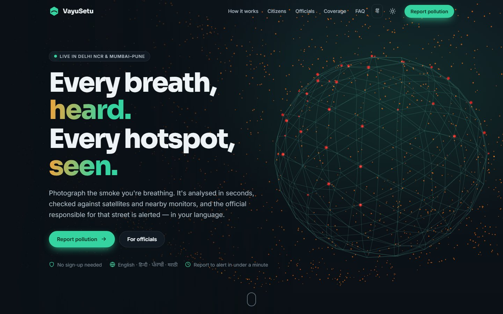
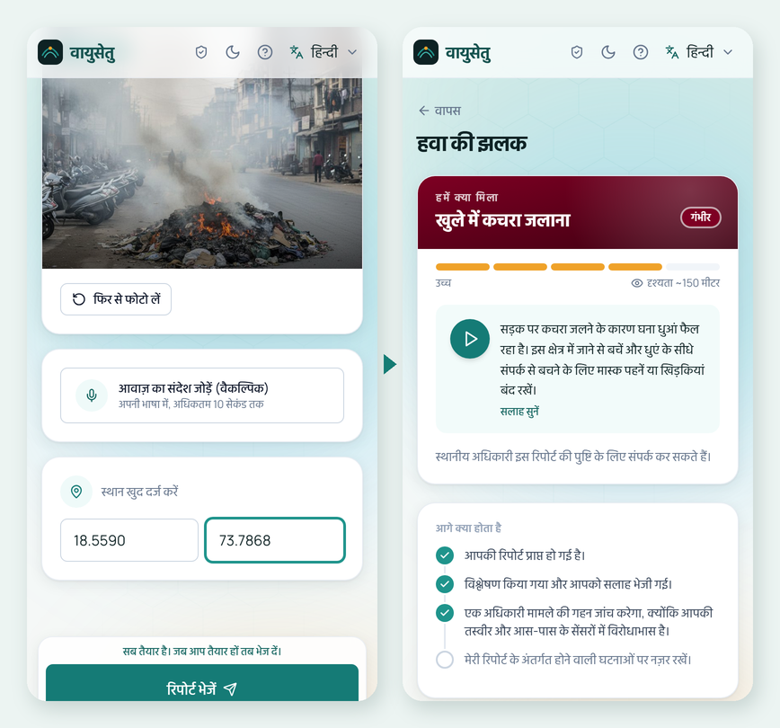
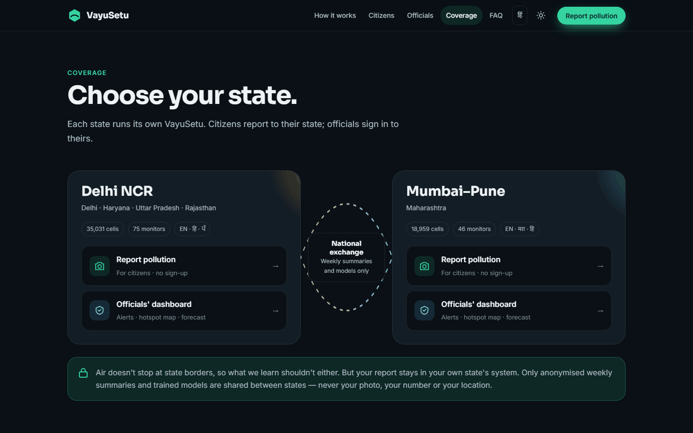
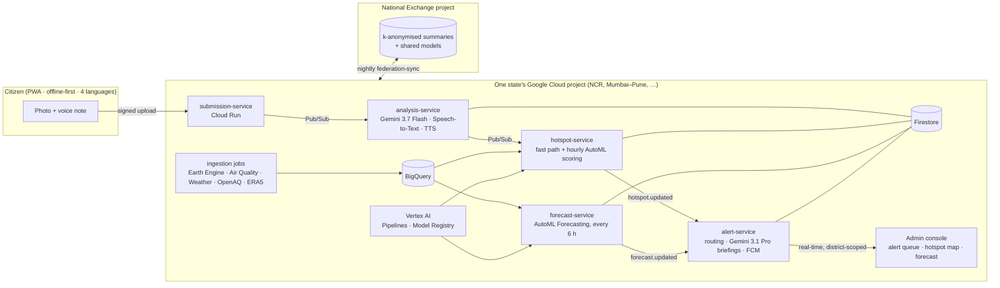

<div align="center">



# VayuSetu · वायुसेतु

### A citizen's photo of smoke becomes a verified pollution hotspot and a live alert on the right official's desk — in under a minute, in their own language.

**[▶ Try it live — vayusetu.web.app](https://vayusetu.web.app)** · Live in **Delhi NCR** and **Mumbai–Pune** · Built entirely on Google Cloud

`Gemini on Vertex AI` · `Vertex AI AutoML` · `Earth Engine` · `BigQuery` · `Cloud Run` · `Firebase` · `Maps Platform` · `Speech & Text-to-Speech`

*Google Cloud Hackathon — Track B: Clean Air & Climate Resilience*

</div>

---

## The problem: pollution starts where nobody is measuring

Delhi covers ~1,500 km² with roughly **40 official air-quality monitors**. A garbage fire, a smouldering landfill or a dusty construction site two kilometres from the nearest monitor **never shows up on the official map**. The first person to know is the one breathing it — and they have no fast, simple way to tell anyone who can act. Officials learn late, from complaints, after the smoke has spread.

The monitor network isn't going to get 100× denser. **The people are already everywhere.**

## What VayuSetu does

<table>
<tr>
<td width="50%" valign="top">

**1 · Rina snaps the smoke.** No sign-up, no typing. A photo — plus an optional voice note in **Hindi, Punjabi, Marathi or English**. Works on patchy 2G and queues offline.

**2 · Gemini reads the air — in seconds.** It names the source, estimates severity and visibility, cross-checks the photo against the nearest monitor and satellite data, and gives advice **in Rina's language, with audio**.

**3 · Citizens + satellites + ML confirm it.** Every 0.7 km² cell of the city is scored by an AutoML model over Sentinel-5P, MODIS/FIRMS fire and weather data. Independent citizen reports push a cell over the alert line — **two different people, never one phone alone**.

**4 · The right official knows — now.** The alert goes only to the officer whose district contains that cell, with a **Gemini-written briefing where every claim cites its evidence**, and a 72-hour, GRAP-aware forecast shows what's coming next.

</td>
<td width="50%" valign="top" align="center">



<sub>The live citizen app in Hindi: a report (generated test photo) → Gemini's "Air Snapshot", with the advice in Hindi text and audio.</sub>

</td>
</tr>
</table>

## Why this is different

| | Typical pollution apps | **VayuSetu** |
|---|---|---|
| **Where it sees** | Only at monitor locations | Every 0.7 km² cell — and it **flags "hidden hotspots" far from any monitor**, the places the official network is blind to |
| **What a report is** | A complaint in a queue | Evidence: AI-triaged, cross-checked against monitors and satellites, fused with an ML model |
| **Who hears about it** | A central inbox | Only the **district officer responsible for that exact cell**, in real time |
| **Trust** | Anyone can spam | Counts **distinct citizens**, not reports; Gemini disagreements with monitors are **flagged for a human**, not silently dropped |
| **Language** | English forms | Voice-first, **4 Indian languages**, AI advice written natively in each (never English-then-translate) |
| **Data ownership** | One central database | **Each state runs its own sovereign deployment.** Only anonymised summaries and trained models cross state lines |

## Proven on the live system — not a mock-up

Every number below comes from the deployed system or its test suites, not from slides.

| | |
|---|---|
| ⚡ **Report → alert** | **≈ 55 seconds** measured live: two citizens → fused score 0.61 → Gemini-briefed alert routed to the Pune district officer |
| 🗺️ **Coverage** | **53,990** hexagonal cells (0.7 km²) across 2 states · 121 official monitors ingested as ground truth |
| 🎯 **Hotspot model** | AutoML Tabular, **auPRC 0.55 vs 0.15 chance — 3.7× better than random** on a *spatial* holdout (unseen places) |
| 🔮 **Forecast** | AutoML Forecasting, 24/48/72 h per corridor, mapped to GRAP stages; MAPE 22.7% |
| 🗣️ **Languages** | Voice in → transcript → Gemini advice → neural speech out, verified live in Hindi, Marathi and Punjabi |
| 🛡️ **Red-teamed** | **27/27** adversarial cases pass — prompt injections hidden *inside photos*, steam vs smoke, requests for medical dosing |
| 📈 **Load** | **0 server errors** across 4,000+ load-test requests; server p95 < 75 ms at pilot traffic |
| ✅ **Tested** | **450+ automated tests** (unit, Firestore security rules, Terraform, end-to-end browser tests) |

## Who it serves — and who pays

| Persona | What they get |
|---|---|
| **Rina**, citizen (peri-urban, mid-range Android, not English-first) | A voice that is heard, and instant advice in her language — without an account |
| **Anand**, field worker with a handheld sensor | Systematic coverage of monitor-blind areas; his PM2.5/PM10 reading is stored with each report, so a measured number sits next to the photo |
| **Officer Deshmukh**, district officer | A live, district-scoped alert queue with evidence and an audit trail — act before complaints escalate |
| **Ms. Iyer**, state climate cell director | A 72-hour forecast of GRAP stages to pre-position resources, and cross-state learning without sharing citizens' data |

**The buyer is the state.** State Pollution Control Boards, the Commission for Air Quality Management in NCR, and the municipal bodies running city clean-air plans under India's National Clean Air Programme already carry the mandate *and* the budget for pollution response — what they lack is eyes between the monitors. VayuSetu is sold as **one deployment per state**, running in the state's own Google Cloud project:

- **Data sovereignty by design** — citizen photos, voices and locations never leave the state's project, which keeps it aligned with India's DPDP Act principles of purpose limitation and minimisation.
- **Pay for what's used** — every service scales to zero; no idle servers between pollution events.
- **No new hardware** — it upgrades the monitor network a state already owns, using phones citizens already carry.

## How it scales across India

**A new state is configuration, not a rewrite.** Mumbai–Pune went from an empty Google Cloud project to live, backfilled and federated **in about a day**, from the same Terraform module and the same code as Delhi NCR — a different geography (coastal, construction dust), a different language (Marathi), zero code changes.



States join a **National Exchange** that no single state owns. Each night a state publishes **k-anonymised, coarsened weekly hotspot summaries** and its **trained models with their metrics**. A state that is just starting can import a model trained where the air problem is similar — and air sheds that cross borders (NCR spans Delhi, Haryana, UP and Rajasthan) get a cross-state view. *This is federated model and insight sharing — batch exchange of models and aggregates — not cryptographic federated learning, and we say so.*

**The path to national scale:** 2 states live → every state capital → all NCAP non-attainment cities, one state deployment at a time, each owning its data.

## Architecture



**Event-driven and serverless:** six Cloud Run services connected by Pub/Sub, eleven scheduled Cloud Run jobs for ingestion and scoring, Firestore for live state, BigQuery for history and features, Vertex AI for training and batch prediction. Everything is Terraform — a new state is `terraform apply` plus a data backfill.

<details>
<summary><b>The full Google stack (click)</b></summary>

| Layer | Google technology |
|---|---|
| AI — reasoning | **Gemini 3.7 Flash** (report triage, function calling), **Gemini 3.1 Pro** (grounded alert briefings), Gemini image (red-team scene generation) — all on **Vertex AI** |
| AI — prediction | **Vertex AI AutoML** Tabular (hotspot confidence) and Forecasting (72 h AQI), **Vertex AI Pipelines** (retraining with a quality gate), **Model Registry** |
| Earth observation | **Earth Engine**: Sentinel-5P NO₂ & aerosol, MODIS/FIRMS fire, land cover, ERA5 meteorology |
| Maps & environment | **Maps JavaScript API**, **Air Quality API**, **Weather API**, **Geocoding API** |
| Voice & language | **Speech-to-Text** (Chirp), **Text-to-Speech** (neural voices), **Cloud Translation** (UI strings only) |
| Compute & events | **Cloud Run** services and jobs, **Pub/Sub**, **Cloud Scheduler**, **Cloud Build** |
| Data | **Firestore** (with jurisdiction-scoped security rules), **BigQuery**, **Cloud Storage** |
| Apps | **Firebase Hosting**, **Firebase Auth** (anonymous + phone OTP), **Firebase Cloud Messaging** |
| Operations | **Cloud Monitoring** (alert policies, uptime checks, dashboards, budgets), **Secret Manager**, **IAM** least privilege |

</details>

## The AI, done responsibly

- **Four Gemini pipelines, each with a narrow job.** (A) photo + voice triage under a strict function-calling schema; (B) spoken advisories via cached neural TTS; (C) official briefings where **every claim must cite a signal** — uncited claims are removed before an officer sees them; (D) when Gemini is genuinely unsure, it can ask the citizen **one** clarifying question instead of guessing.
- **Grounded, not trusted blindly.** Every photo assessment is cross-validated against the nearest monitor and modelled AQI. When they disagree, the report is **flagged for human review** — and a visible fire still counts, because a fire the monitor can't see is exactly the hidden hotspot we exist to find.
- **Honest models.** Both models ship with [model cards](docs/models/) that report the naive baseline next to every metric — including a hotspot model we **rejected** after finding its headline score was inflated by an averaging choice. The retraining pipeline now gates on the metric that matters.
- **Red-teamed.** A [27-case adversarial set](packages/gemini-client/redteam/) — injection text hidden inside photos, look-alikes (steam, fog, sunsets), off-topic images, requests for medicine doses. The failures we found became prompt rules; all 27 pass.
- **Anti-spam by construction.** Alert thresholds count *distinct citizens*; one phone re-reporting counts once.

## Built to run, not just to demo

- **Security:** least-privilege IAM ([audit](docs/security/IAM_AUDIT.md)); private services where the public never needs access; jurisdiction-scoped Firestore rules with emulator tests; no secrets in code; per-user rate limits.
- **Operations:** 17 alert policies per state (errors, rate limits, failed jobs, stale data, dead letters, uptime), dashboards, budget alerts and a [runbook](docs/RUNBOOK.md) with real incident write-ups.
- **Quality:** 450+ automated tests; contract tests keep the [OpenAPI spec](docs/api/openapi.yaml) and shared types in lock-step; a Firestore fake that enforces the real composite indexes, so a missing index fails in tests instead of in production.
- **Load-tested** on the live deployments ([results](packages/loadtest/README.md#results-29-sep-2026-run-by-chirag-from-bengaluru-server-side-figures-from-cloud-run-request-logs)).

## Honest status

| Live and verified end to end | Next |
|---|---|
| Citizen reporting (photo + voice, 4 languages, offline), Gemini triage and spoken advice, hotspot fusion and hidden hotspots, district-routed alerts with Gemini briefings, 72 h GRAP forecasts, official workflow with audit trail, two state deployments, landing page | **Cross-state model copy** — summaries and the model catalogue are live; the Vertex AI model copy between projects is awaiting one IAM role change |
| Delhi NCR runs trained AutoML hotspot and forecast models | **Mumbai–Pune** currently uses the rules-based scorer and a persistence forecast until it has enough local history to train its own (or imports NCR's) |
| | **Phase 2:** an IVR hotline for feature phones (Vertex AI Agent Builder), secure-aggregation federated learning, CI on every pull request |

## Try it

| | |
|---|---|
| 🌐 **Start here** | **[vayusetu.web.app](https://vayusetu.web.app)** — choose a state |
| 📷 **Report as a citizen** | [Delhi NCR](https://vayusetu-ncr-dev.web.app) · [Mumbai–Pune](https://vayusetu-mh-dev.web.app) — no sign-up; on a laptop, choose a photo and type the location (e.g. Karol Bagh, 28.65041, 77.19009) |
| 🛡️ **Officials' console** | [Delhi NCR](https://vayusetu-ncr-dev-admin.web.app) · [Mumbai–Pune](https://vayusetu-mh-dev-admin.web.app) — accounts are provisioned per official; demo credentials are shared with judges separately |
| 💻 **Run it locally, no keys needed** | Both apps ship a full mock mode: `corepack enable && pnpm install && pnpm dev` → [developer guide](docs/DEVELOPMENT.md) |

## Repository map

```
apps/
  citizen-pwa/          React PWA — capture, Air Snapshot, my reports, offline queue, 4 languages
  admin-dashboard/      Officials' console — alert queue, hotspot map, forecast, federation, Lite Mode
  portal/               Landing page (vayusetu.web.app)
  submission-service/   Users, submissions, signed uploads, corridors, resource requests
  analysis-service/     Pipeline A/B/D — Gemini triage, Speech-to-Text, Text-to-Speech
  hotspot-service/      Citizen fast path + hourly AutoML scoring, hidden hotspots
  forecast-service/     72 h forecasts, GRAP stages
  alert-service/        Severity, routing, deduplication, Pipeline C briefings, push
  federation-service/   k-anonymised exchange, model publish/import
  ingestion-jobs/       Earth Engine, Air Quality, Weather, OpenAQ, ERA5, rollups (Python)
packages/               shared-types, gemini-client (+ red-team set), gcp-clients, h3-utils, ui-components, loadtest
ml/                     Vertex AI pipelines, training, evaluation gate
infra/terraform/        One module per state + the National Exchange
docs/                   Architecture, API, model cards, runbook, demo script
```

**Deeper reading:** [product & architecture](docs/PRD_AND_ARCHITECTURE.md) · [API (OpenAPI)](docs/api/openapi.yaml) · [model cards](docs/models/) · [IAM audit](docs/security/IAM_AUDIT.md) · [runbook](docs/RUNBOOK.md) · [demo script](docs/DEMO.md) · [developer guide](docs/DEVELOPMENT.md)

## Team

Built by **Aamir** (frontend & experience), **Chirag** (backend, infrastructure & AI) and **Anjan** (data & ingestion).

<div align="center">
<sub>VayuSetu — <i>vāyu</i> (air) + <i>setu</i> (bridge): a bridge between the people who breathe the air and the people who can clean it.</sub>
</div>
