# VayuSetu — PRD & Architecture Specification
### *Build with AI: Code for Communities 2.0 — Track B: Clean Air & Climate Resilience*

**Document version:** 1.0 · **Prepared for:** 4-engineer founding team · **Build window:** 30 days
**Status:** Locked — decisions in this document are final and binding for the build. No open questions remain.

---

## Table of Contents

1. [Concept Selection & Judging Matrix Alignment](#1-concept-selection--judging-matrix-alignment)
2. [Product Requirements Document (PRD)](#2-product-requirements-document-prd)
3. [End-to-End System & AI Architecture](#3-end-to-end-system--ai-architecture)
4. [Zero-Conflict API Contracts & TypeScript Interfaces](#4-zero-conflict-api-contracts--typescript-interfaces)
5. [Repository Skeleton & File Map](#5-repository-skeleton--file-map)
6. [30-Day Modular Work Division Plan](#6-30-day-modular-work-division-plan)

---

## 1. Concept Selection & Judging Matrix Alignment

### 1.1 The Application

> ## **VayuSetu**
> ### *Citizen Eyes. Satellite Sight. Statewide Action — One Breath Ahead of the Smog.*

**Elevator pitch (3 sentences):**
VayuSetu is a federated, AI-powered early-warning platform that fuses citizen-submitted photos, low-cost sensor readings, satellite trace-gas and fire data, and India Meteorological Department (IMD) weather data into a single hyperlocal pollution-intelligence layer covering India's most polluted economic corridors. Using Gemini's multimodal reasoning to turn a single citizen photo into a structured, geolocated, source-classified data point, and Vertex AI forecasting models to predict AQI spikes 24–72 hours before they happen, VayuSetu converts scattered signals into ranked, actionable alerts routed directly to the district and state officials empowered to act. It is architected as a federated network from day one — every state or city that deploys VayuSetu keeps its raw citizen and operational data inside its own Google Cloud project, while still contributing to and drawing from a shared, ever-improving national model — turning India's air-quality response from reactive and siloed into predictive and coordinated.

*("VayuSetu" — from Sanskrit/Hindi **vayu** = air/wind, and **setu** = bridge. The name is deliberately load-bearing: it is the bridge between citizen and satellite data, between prediction and official action, and — the platform's central architectural bet — between one state's data and another's.)*

**Name:** VayuSetu · **Tagline:** *Citizen Eyes. Satellite Sight. Statewide Action.* · **Category:** Federated Climate Action Platform (Track B)

---

### 1.2 Why This Concept, and Not the Alternatives We Debated

Three other concepts were seriously evaluated and rejected. Recording *why* matters more than recording *that* — it is the difference between a defensible product decision and a guess:

| Rejected Concept | Why It Loses |
|---|---|
| **Stubble-burning-only detector** (satellite fire detection + farmer SMS alerts) | Strong problem-solution fit for *one* pollution source, but the brief explicitly asks for hyperlocal detection across *industrial, agricultural, and urban* sources. A single-source tool caps Impact Potential and Depth & Reach — it is a feature, not the platform, and would score well on focus but poorly on the 20% Depth & Reach and 15% Impact Potential lines. |
| **"AQI chatbot"** (a Gemini-powered conversational assistant answering "is the air safe today?" over existing CPCB data) | This is the most common failure mode we anticipate from competing teams: bolting an LLM onto data that already exists and calling it AI-powered. It scores near-zero on the actual stated problem ("absence of real-time, granular data") because it does not generate *any* new data — it only re-narrates monitors that already publish dashboards. AI Execution would look superficial to an experienced judge, since the model does no work a lookup couldn't do. |
| **Citizen-crowdsourcing map with no satellite/forecast/ML layer** (a "Waze for pollution") | Solves *part* of the granularity problem but is reactive, not predictive, and has no mechanism for hidden-hotspot detection where citizen density is itself sparse (which correlates with exactly the semi-urban and rural areas the brief cares about). It also has zero answer for the "designed for interoperability" requirement, which we judge to be the single most differentiating and highest-leverage line in the entire brief. |

VayuSetu wins because it is the only concept that treats **all four** named data sources (citizen, sensor, satellite, meteorological) as first-class inputs to **both** named outputs (hotspot detection, spike forecasting) **and** the interoperability requirement as core architecture rather than an afterthought slide.

---

### 1.3 Direct Mapping to the Official Grading Matrix

*(The brief references "6 evaluation categories" but the published grading matrix defines 5 weighted categories summing to 100%. We map to the 5 as published, since that is what will actually be scored against.)*

#### AI Execution — 25%
Google AI is not decorative; it is the mechanism that manufactures the platform's core asset. **Gemini 3.7 Flash** converts every citizen photo into a structured, geolocated, source-classified, severity-scored data point via function calling — this is the *only* way the "hyperlocal" half of the brief gets solved, because no other technology can turn an unstructured photo into a usable spatial data point at citizen-reporting scale and cost. **Gemini 3.1 Pro** performs grounded reasoning over fused sensor/satellite/met data to draft human-actionable, audit-citable official briefings — not a chatbot wrapper, but the last-mile translation from "model output" to "thing a District Magistrate can act on in 30 seconds." **Vertex AI AutoML Tabular and AutoML Forecasting** do the actual prediction (hidden-hotspot confidence scoring; 72-hour AQI forecasting) that the brief explicitly asks for. The prototype is end-to-end and demoable: photo in → classified, geolocated, cross-validated data point out → fused into an hourly hotspot grid → forecast → alert on an official's screen, in one continuous, observable pipeline.

#### Deployability / Scalability — 20%
Every service is Cloud Run (scale-to-zero — a real cost concern for a government pilot, not a hackathon toy concern) or a scheduled Cloud Run Job. The **corridor** is a first-class configuration object, not a hardcoded region — onboarding a new state or city is a data/config exercise (new corridor polygon, new monitoring station list, new jurisdiction mapping), not a re-architecture. The **Federation Exchange** (Section 3.4) is explicitly designed around the real, well-known constraint that Indian state governments will not adopt a system requiring them to surrender raw citizen data to a central authority, but *will* adopt one that lets them keep full data sovereignty while still benefiting from shared model improvements — this is the single design choice most likely to survive contact with an actual ministry procurement conversation. Section 3.3 also names, explicitly, the one licensing trap (Google Earth Engine's noncommercial-tier exclusion for government tooling) that would otherwise blow up a pilot's budget six months in — we would rather lose a small amount of "wow factor" now than have a judge who knows GCP catch us overpromising.

#### Problem-Solution Fit — 20%
Re-reading the brief's own sentences against the product: *"Major Indian cities monitor macro-level air quality but consistently miss hyper-local pollution events"* → solved by the Hotspot Fusion Engine's explicit hidden-hotspot flag (Section 2.2, Feature 2). *"Combines citizen-sourced data... with satellite imagery and meteorological data"* → all three are named, first-class inputs to one fusion model, not three separate features. *"Forecast air quality spikes across major economic corridors"* → the Forecaster (Feature 3) does exactly this, in GRAP-aligned language a working Indian pollution-control officer already uses. *"Alert relevant authorities for rapid intervention"* → the Alert Service's jurisdiction-aware routing and status-tracked lifecycle (Section 3.5) is a closed loop, not a dashboard. *"Designed for interoperability so Indian cities and states can share predictive models and coordinate resources"* → this sentence is, almost verbatim, the Federation Exchange's product spec (Feature 4).

#### Depth & Reach Across India — 20%
The corridor abstraction (Section 2.1, Persona-driven design in Section 2) is what makes "one city to all of India" a real claim rather than a slogan: the pilot targets two structurally different airsheds — the **Delhi-NCR Airshed** (GRAP-governed, dominated by a mix of vehicular, industrial, construction, and seasonal agricultural-burning inflow from Punjab/Haryana) and the **Mumbai–Pune Industrial Corridor** (non-GRAP, dominated by industrial and vehicular sources, coastal meteorology) — specifically to prove the fusion model and forecasting pipeline generalize across pollution *regimes*, not just geography. Multilingual support (Section 2.3) is a platform capability, not a per-state custom build. The Federation Exchange means the 6th, 10th, or 20th state onboarding VayuSetu starts from a warm model, not a cold one — the network gets *more* valuable, not more expensive, as it spreads, which is the actual technical definition of "depth and reach."

#### Impact Potential — 15%
The NCR airshed alone spans a population in the tens of millions across four states; scaled nationally across India's declared non-attainment and economic-corridor cities, the addressable population is measured in the hundreds of millions. But the more important impact claim is *qualitative*: VayuSetu targets exposure that is currently **invisible** to any existing system — the areas with the sparsest official monitor coverage are structurally the same tier-2/tier-3 and peri-urban/rural areas where citizens today have literally zero hyperlocal information about the air they breathe. Closing that gap, even partially, is a health-equity intervention as much as a data intervention.

---

### 1.4 The Core Innovation — What Makes This Dramatically Superior to Existing Civic/Government Systems

Existing systems in this space — India's own National Air Quality Index app, SAFAR, state pollution-control-board dashboards, and third-party aggregators (IQAir, aqicn.org) — all share the same fundamental limitation: **they visualize data from existing official monitors, and India has roughly 1,500 continuous monitors for 1.4 billion people.** They are read-only info radiators built on top of a sparse network. No amount of better UI fixes a coverage-density problem.

VayuSetu is architecturally different in four specific, defensible ways:

1. **It manufactures data where none exists**, rather than better-visualizing data that already does. The Hotspot Fusion Engine's entire purpose is flagging grid cells with strong fused evidence of a pollution event *despite zero nearby official monitor coverage* — this is the literal, technical definition of "hidden hotspot," and it is the one thing no existing dashboard can do by construction.
2. **It is predictive, not historical.** Every incumbent system answers "what was the air like." VayuSetu's Forecaster answers "what will the air be in 24–72 hours, and at what GRAP-equivalent severity" — the difference between an advisory issued *before* a spike (construction paused pre-emptively) and one issued after (nothing left to do but log the event).
3. **It closes the loop.** An alert has an assigned jurisdiction, an assigned officer, a status lifecycle, and a notification trail. Existing dashboards have none of this — they are read, not acted on, and there is no way to know if they were.
4. **It treats data sovereignty as a design constraint, not an obstacle** — the Federation Exchange (Section 3.4) is the one piece of this system that is genuinely hard to copy in a weekend hackathon submission, because it requires actually reasoning about why India's state-level govtech systems stay siloed today (they are not siloed by accident — data ownership and political accountability are real constraints) and designing *around* that constraint instead of wishing it away. A system that requires Rajasthan to send its raw citizen-submitted data to a Delhi-run central server will not get procured. A system that lets Rajasthan keep everything local while still improving from what Delhi, Haryana, and UP have already learned, will.


---

## 2. Product Requirements Document (PRD)

### 2.1 Target User Personas

#### Primary Persona 1 — **Rina, the Citizen Reporter**
Age 20–45, lives in a peri-urban neighborhood in the NCR or Mumbai–Pune corridor, owns a mid-range Android phone on a prepaid data plan, is not necessarily fluent in English or comfortable with dense text UI. She notices visible smoke from a neighborhood lot being used for waste burning, or haze that makes her hesitant to send her kids outside. She wants to (a) report what she sees in under 30 seconds, (b) get an immediate, plain-language answer to "is it safe right now," and (c) feel like reporting *did something*, even if she never personally sees the outcome.

**Needs:** near-zero-friction capture flow, voice option in her own language, an answer she can act on immediately, no login wall that blocks a first-time report.

#### Primary Persona 2 — **Anand, the Frontline Field Worker**
A field officer for an environmental NGO or a state pollution-control-board contractor, sometimes equipped with a low-cost handheld/portable sensor, systematically covering areas with no fixed monitor — industrial belts, agricultural-burning-adjacent villages, construction corridors. He is a semi-power-user: he reports more often, cares about historical trend for "his" area, and is often the actual source of ground-truth photos that anchor the Hotspot Fusion Engine's confidence in a new area.

**Needs:** batch/systematic reporting mode, ability to attach a sensor reading alongside a photo, a personal dashboard of "my area's" trend over time, offline queueing for low-connectivity field visits.

#### Secondary Persona 3 — **Officer Deshmukh, the District Administrator / SPCB Field Officer**
Responsible for a specific district's pollution-response actions — inspection dispatch, public advisories, GRAP-stage-linked interventions. Receives far more raw information than she can act on today; the failure mode she fears is not "too little data," it's "an alert I can't tell is real, credible, or actionable in the 15 seconds I have to triage it."

**Needs:** jurisdiction-filtered alert queue (only *her* district), one-glance severity + recommended action, one-tap status update, an audit trail she can defend in a review meeting.

#### Secondary Persona 4 — **Ms. Iyer, the State Climate Resilience Cell Director**
Cross-district view, resource allocation authority (anti-smog guns, mobile monitoring vans, inspection teams), and — uniquely — the persona who cares about the Federation Exchange, because she is the one deciding whether her state's pilot budget and political capital are well spent adopting a system that also benefits (and can learn from) neighboring states across a shared airshed.

**Needs:** corridor-level (not just district-level) forecast view, resource-request visibility across her state, and confidence that her state's raw data stays inside her state's control even while the model improves.

---

### 2.2 Core Feature Specifications

#### Feature 1 — "Snap & Sense": Multimodal Citizen Reporting
**User story:** *As Rina, I want to photograph visible pollution near me and immediately understand whether it's currently dangerous, without typing anything, in Hindi (or my language).*

- **Required inputs:** camera photo (required); optional 10-second voice note; device GPS (required, with a manual pin-drop fallback if GPS is denied/unavailable); optional field-worker sensor reading (PM2.5/PM10 numeric, for Persona 2 only).
- **Processing logic:** On submit, the photo and any voice note upload to Cloud Storage while a `Submission` document writes to Firestore with `status: 'queued'`. A Firestore-triggered event publishes `submission.created`. The `analysis-service` resolves the submission's `h3Index` and `jurisdiction` via reverse geocoding, pulls the nearest official monitor reading and satellite aerosol index for that cell as *context* (not ground truth), transcribes any voice note via Cloud Speech-to-Text, and calls **Gemini 3.7 Flash** with the photo + context under the `record_air_quality_assessment` function schema (full prompt and schema in Section 3.3). The structured result is cross-validated, written as an `AnalysisResult`, and — if `confidenceScore` and cross-validation agreement both clear a configured threshold — folded into the rolling hourly aggregate that feeds Feature 2.
- **Output to the citizen:** an "Air Snapshot" card — plain-language source + severity + one-line health advisory, delivered as text and (if the citizen has voice mode on) as synthesized audio in their preferred language, typically within 4–8 seconds of submission.

#### Feature 2 — "Hotspot Fusion Engine" (The Detector)
**User story:** *As Officer Deshmukh, I want to know about pollution events in my district even in the neighborhoods with no monitor, before a citizen complaint escalates.*

- **Required inputs:** rolling hourly aggregates of citizen `AnalysisResult`s per H3 cell; satellite features (Sentinel-5P NO₂ column and aerosol index, VIIRS/MODIS active-fire detections, Sentinel-2 burn-scar polygons) via Earth Engine; IMD meteorology (wind speed/direction, boundary-layer height, temperature, humidity); official CPCB/SPCB monitor readings via data.gov.in as calibration ground truth.
- **Processing logic:** Hourly, the `hotspot-service` (Cloud Run Job, triggered by Cloud Scheduler) joins all four signal families on `(h3Index, hour)`, scores every cell in every active corridor with the **Vertex AI Hotspot Confidence Model** (AutoML Tabular), and flags a cell `isHidden: true` when its fused confidence is high *and* no official monitor exists within a configured radius (default 3 km) — this flag is the literal, auditable definition of a "hidden hotspot."
- **Output:** an updated `HotspotCell` grid per corridor, rendered as a live heatmap on the Admin Dashboard, and a `hotspot.updated` event that the Alert Service evaluates against severity thresholds.

#### Feature 3 — "72-Hour Forecast & GRAP-Style Escalation" (The Forecaster)
**User story:** *As Ms. Iyer, I want to know 2–3 days ahead of time that my corridor is heading into a severe-AQI window, with enough lead time to pre-position resources.*

- **Required inputs:** each corridor's historical AQI time series, IMD short-range meteorological forecast, seasonal-burning calendar (Punjab/Haryana harvest windows feeding the NCR airshed), and a festival/traffic calendar (Diwali firecracker season is a well-documented, recurring AQI-spike driver in North Indian cities).
- **Processing logic:** Every 6 hours, `forecast-service` scores each active corridor with the **Vertex AI Forecast Model** (AutoML Forecasting) across 24/48/72-hour horizons. Any horizon point crossing a corridor's configured GRAP/CAQM stage threshold triggers `forecast.updated`, which the Alert Service passes to **Gemini 3.1 Pro** to draft a grounded, citable briefing (full prompt in Section 3.3) — title, description, implied GRAP stage, 2–4 ranked recommended interventions, and a citizen-safe public advisory, all traceable back to the specific signals that justified them.
- **Output:** a corridor-level forecast chart on the dashboard, plus, when thresholds are crossed, a routed `Alert` with a full audit trail.

#### Feature 4 — "The Bridge": Federated Model & Resource Exchange
**User story:** *As Ms. Iyer, I want my state's pilot to benefit from what Delhi and Haryana have already learned, without sending a single citizen's photo outside my state's own cloud project.*

- **Required inputs:** each state deployment's locally trained model artifacts (Vertex AI Model Registry entries) and k-anonymized, coarsened hotspot aggregates (only published where the underlying citizen-report count clears a minimum threshold, and at a lower H3 resolution than the internal operational grid).
- **Processing logic:** Nightly, `federation-service` exports the local model version + performance metrics + aggregate statistics to the shared National Exchange (a dedicated BigQuery dataset + Vertex AI Model Registry namespace), and pulls other states' shared model versions, which a `super_admin` can review and import to bootstrap a new or under-data state deployment. For corridors that physically span state lines (the NCR airshed spans Delhi, Haryana, UP, and Rajasthan), the Exchange also serves a cross-state aggregated hotspot view so no single state is flying blind on pollution that started across a border it doesn't control.
- **Output:** a "Federation" panel in the Admin Dashboard (state-admin and above) showing available shared models, a one-click import action, and a Resource Coordination Board where states can post and see resource needs/commitments for a shared airshed event.
- **Honesty note, stated explicitly because it matters for credibility:** this is federated *model and insight* sharing (batch export/import of trained artifacts and aggregated statistics), not cryptographic federated learning with secure gradient aggregation. That is the correct, buildable scope for a 30-day system and is flagged in the roadmap (Section 6) as the natural Phase 2 hardening step once the network has enough nodes to make it worthwhile.

---

### 2.3 Multilingual & Accessibility Strategy

- **Voice-in:** Cloud Speech-to-Text transcribes citizen voice notes across the initial language set (Hindi, English, Punjabi, Marathi, Haryanvi handled as a Hindi dialect variant) at submission; Gemini's own multilingual generation produces the response advisory directly in the citizen's `preferredLanguage` rather than generating in English and machine-translating, which we choose specifically because dynamic, generated content (an advisory sentence) reads more naturally when the model composes it in-language than when it is translated after the fact.
- **Voice-out:** every advisory and alert has a Cloud Text-to-Speech (Neural2/Chirp voice) rendering, cached in Cloud Storage, so a low-literacy citizen who can speak a language but not read its script still gets the full experience.
- **Static UI strings** (buttons, labels, onboarding copy) are localized via Cloud Translation API into cached translation bundles shipped with the PWA — cheaper and more consistent than an LLM call for fixed copy, and this is a deliberate division of labor: **Gemini generates dynamic, per-event content; Translation API handles static, cacheable UI content.**
- **Language switching** is a single persistent control, stored on the `User.preferredLanguage` field and applied without requiring re-login.
- **Low-bandwidth resilience:** the Citizen PWA is offline-capable — a photo/voice submission queues locally (via a Workbox-backed service worker and IndexedDB) if connectivity drops mid-capture, and syncs automatically on reconnect; photo uploads are client-side compressed and resized before transmission, with quality scaled down automatically on detected 2G/3G connections; the Admin Dashboard has a "Lite Mode" that trades the live map for a plain sortable table for officials on constrained connections.
- **Phase 2 (explicitly not in the 30-day core scope, but architected for):** an IVR hotline built on **Vertex AI Agent Builder – Conversational Agents** (the current product name for what the hackathon brief calls "Dialogflow") + Cloud Speech-to-Text, letting a citizen with a basic feature phone report by voice call with no app or smartphone required. This is called out as Phase 2 because it requires a telephony/carrier integration outside the Google Cloud stack, which is a real dependency we are not willing to pretend is a 30-day item.

---

## 3. End-to-End System & AI Architecture

### 3.1 Architectural Data Flow Diagram

```mermaid
flowchart TB
    subgraph CLIENT["Client Layer"]
        CIT["Citizen PWA<br/>React + Vite + Workbox"]
        ADMIN["Admin / Official Dashboard<br/>React + Vite"]
    end

    subgraph INGEST["Ingestion Layer"]
        SUB["submission-service<br/>(Cloud Run)"]
        EEJOB["Earth Engine Ingestion Job<br/>(Cloud Run Job, hourly)"]
        METJOB["IMD Met Ingestion<br/>(Cloud Function, hourly)"]
        CPCBJOB["CPCB / data.gov.in Ingestion<br/>(Cloud Function, hourly)"]
    end

    subgraph STORE["Storage Layer"]
        FS[("Firestore<br/>operational data")]
        BQ[("BigQuery<br/>analytical data")]
        GCS[("Cloud Storage<br/>media + artifacts")]
    end

    subgraph AI["AI / ML Layer (Vertex AI)"]
        GEMFLASH["Gemini 3.7 Flash<br/>multimodal triage"]
        GEMPRO["Gemini 3.1 Pro<br/>briefing / reasoning"]
        HSMODEL["Hotspot Confidence Model<br/>(AutoML Tabular)"]
        FCMODEL["AQI Forecast Model<br/>(AutoML Forecasting)"]
    end

    subgraph SERVICES["Processing Services (Cloud Run)"]
        ANALYSIS["analysis-service"]
        HOTSPOT["hotspot-service"]
        FORECAST["forecast-service"]
        ALERT["alert-service"]
        FEDERATION["federation-service"]
    end

    subgraph NOTIFY["Notification Layer"]
        FCM["Firebase Cloud Messaging"]
        GATEWAY["SMS / WhatsApp Gateway<br/>(pluggable partner)"]
    end

    subgraph EXCHANGE["National Federation Exchange"]
        REGISTRY[("Vertex AI Model Registry<br/>shared namespace")]
        EXBQ[("Shared BigQuery Dataset<br/>k-anonymized aggregates")]
    end

    CIT -- "photo + voice + GPS" --> SUB
    SUB -- "write Submission" --> FS
    SUB -- "upload media" --> GCS
    SUB -- "publish submission.created" --> ANALYSIS
    ANALYSIS -- "multimodal call" --> GEMFLASH
    GEMFLASH -- "structured JSON (function call)" --> ANALYSIS
    ANALYSIS -- "write AnalysisResult" --> FS
    ANALYSIS -- "publish analysis.completed" --> HOTSPOT

    EEJOB -- "satellite features" --> BQ
    METJOB -- "meteorology features" --> BQ
    CPCBJOB -- "ground-truth AQI" --> BQ

    HOTSPOT -- "read fused features" --> BQ
    HOTSPOT -- "read citizen aggregates" --> FS
    HOTSPOT -- "score cells" --> HSMODEL
    HOTSPOT -- "write HotspotCell grid" --> BQ
    HOTSPOT -- "push top cells" --> FS
    HOTSPOT -- "publish hotspot.updated" --> ALERT

    FORECAST -- "read historical + features" --> BQ
    FORECAST -- "score corridor" --> FCMODEL
    FORECAST -- "write ForecastRun" --> BQ
    FORECAST -- "publish forecast.updated" --> ALERT

    ALERT -- "draft briefing" --> GEMPRO
    ALERT -- "write Alert" --> FS
    ALERT --> FCM
    ALERT --> GATEWAY
    FCM --> ADMIN
    GATEWAY -- "SMS / WhatsApp" --> ADMIN

    ADMIN -- "real-time listeners" --> FS
    ADMIN -- "historical queries" --> BQ

    FEDERATION -- "nightly export" --> REGISTRY
    FEDERATION -- "nightly export" --> EXBQ
    FEDERATION -- "pull shared versions" --> REGISTRY
    REGISTRY -.->|"bootstrap on import"| HSMODEL
    REGISTRY -.->|"bootstrap on import"| FCMODEL
```



**Narrative walkthrough of the numbered flow:**

1. A citizen or field worker submits a photo (+ optional voice note + GPS) through the Citizen PWA. `submission-service` writes the `Submission` to Firestore and the media to Cloud Storage, then publishes `submission.created` to Pub/Sub.
2. `analysis-service` consumes the event, resolves jurisdiction and H3 cell, pulls nearby context (nearest monitor reading, satellite aerosol index), and calls Gemini 3.7 Flash with the photo under a strict function-calling schema. The structured `AnalysisResult` is written back to Firestore and the citizen receives their localized "Air Snapshot" within seconds.
3. In parallel, three scheduled jobs continuously backfill BigQuery: Earth Engine ingestion (satellite trace-gas, fire, and burn-scar data), IMD meteorology ingestion, and CPCB/data.gov.in ground-truth monitor ingestion.
4. Hourly, `hotspot-service` fuses all four signal families per H3 cell, scores them with the Hotspot Confidence Model, and flags hidden hotspots — cells with strong fused evidence and no nearby official monitor.
5. Every 6 hours, `forecast-service` scores each corridor's 24/48/72-hour AQI trajectory with the Forecast Model.
6. Threshold-crossing hotspot or forecast events reach `alert-service`, which asks Gemini 3.1 Pro to draft a grounded, jurisdiction-routed briefing, then dispatches it via Firebase Cloud Messaging (dashboard) and an SMS/WhatsApp gateway (field officers without the dashboard open).
7. Officials act on the Admin Dashboard, which subscribes to Firestore in real time for alerts and queries BigQuery for historical/trend views.
8. Nightly, `federation-service` publishes this deployment's model versions and k-anonymized aggregate statistics to the shared National Exchange, and pulls other states' shared versions — the mechanism by which a new state deployment starts warm instead of cold.

---

### 3.2 Google Cloud Services Integration Breakdown

| GCP Service | Exact Role in VayuSetu | Design Rationale |
|---|---|---|
| **Firebase Authentication** | Phone-OTP auth for citizens; email/SSO + custom claims (`role`, `stateCode`, `districtCode`) for officials | India-standard phone-first identity; custom claims drive both Firestore security rules and API-layer authorization without a separate identity service |
| **Firebase Hosting** | Serves the Citizen PWA and Admin Dashboard static builds via global CDN | CDN-backed, integrates natively with Firebase Auth session state, fast first-load on 3G — critical for the citizen-facing surface |
| **Cloud Run (services)** | Hosts `submission-service`, `analysis-service`, `hotspot-service`, `forecast-service`, `alert-service`, `federation-service` as independently deployable containers | Scale-to-zero keeps a government pilot's idle-hours cost near $0; each engineer owns isolated services with independent deploy cadence — see Section 5 ownership map |
| **Cloud Run Jobs** | Scheduled batch workloads: Earth Engine export, hourly/6-hourly model scoring triggers, nightly federation sync | Purpose-built for finite-duration batch tasks (vs. always-on Cloud Run services), billed only for actual execution time |
| **Cloud Functions (2nd gen)** | Lightweight event glue: Firestore `onCreate` triggers, Pub/Sub push adapters for the ingestion Cloud Functions | Avoids standing up a full Cloud Run service for single-purpose, low-volume event handlers |
| **Cloud Pub/Sub** | Event backbone: `submission.created`, `analysis.completed`, `hotspot.updated`, `forecast.updated` | Decouples every service so four engineers can build and deploy independently — a publisher never needs to know which service(s) subscribe |
| **Firestore (Native mode)** | Operational, real-time data: `submissions`, `analysisResults`, `alerts`, `users`, live dashboard state | Real-time listeners push new alerts to the Admin Dashboard with zero polling; document model fits the citizen-submission and alert-lifecycle shapes well |
| **BigQuery** | Analytical layer: satellite features, meteorology features, ground-truth AQI, training datasets, Federation Exchange tables | Petabyte-scale SQL for the fused, joined, spatio-temporal tables the ML models train and score against; see Section 3.4 for schema |
| **Cloud Storage** | Buckets for raw citizen media, Earth Engine exports, model artifacts, synthesized advisory audio | Durable, cheap object storage; the PWA uploads directly via signed URLs so binary media never round-trips through Cloud Run |
| **Vertex AI – Gemini API** | Multimodal photo/voice triage (**Gemini 3.7 Flash**); alert-briefing and advisory generation (**Gemini 3.1 Pro**) | Enterprise-grade access path (VPC Service Controls, IAM, regional data residency options) appropriate for a system processing citizen-submitted, geolocated data on behalf of government bodies |
| **Vertex AI – AutoML Tabular** | Trains the Hotspot Confidence Model on the fused BigQuery feature table | No-code/low-code path to a production tabular classifier inside the 30-day window — a 4-person team cannot hand-roll and validate a custom architecture and still ship |
| **Vertex AI – AutoML Forecasting** | Trains the 72-hour AQI Forecast Model per corridor (ARIMA+-based under the hood) | Purpose-built managed time-series forecasting; avoids reinventing seasonality and holiday/event-effect handling from scratch |
| **Vertex AI Model Registry & Endpoints** | Versions and serves both models; is the literal mechanism the Federation Exchange uses to publish and pull models across state deployments | Gives every state deployment a private registry plus a defined, auditable path to publish/import versions to/from the shared Exchange namespace |
| **Vertex AI Pipelines** | Orchestrates the retrain loop: BigQuery feature extraction → train → evaluate → conditionally register → conditionally deploy | Reproducible, auditable retraining — essential once multiple states are contributing data over time and "which model version produced this alert" must be answerable |
| **Google Earth Engine** | Satellite ingestion: Sentinel-5P (NO₂ column, aerosol index), VIIRS/MODIS active-fire detections, Sentinel-2 burn-scar mapping | The only practical source of trace-gas and fire data at national scale — see licensing note below, which we treat as load-bearing, not a footnote |
| **Google Maps Platform** | Maps JavaScript API (submission map picker, hotspot heatmap); Geocoding API (reverse-geocode a submission's GPS to district/state jurisdiction) | Jurisdiction-correct alert routing is impossible without accurate reverse geocoding — this is not a cosmetic map, it drives who gets notified |
| **Cloud Speech-to-Text** | Transcribes citizen voice notes across the initial language set | Purpose-built ASR outperforms and out-scales asking a multimodal model to do raw audio-to-text at national-rollout submission volumes |
| **Cloud Text-to-Speech** | Synthesizes localized advisories and alerts as audio (Neural2/Chirp voices) | Closes the loop for low-literacy citizens who can speak a language but not read its script |
| **Cloud Translation API** | Localizes static UI strings and cached advisory templates | Cheaper and more consistent than an LLM call for fixed copy; deliberately complements — not replaces — Gemini's native in-language generation for dynamic content |
| **Vertex AI Agent Builder – Conversational Agents** | Powers the Phase-2 IVR hotline for feature-phone reporting | This is the current product surface for what the hackathon brief calls "Dialogflow" (Dialogflow CX's capabilities now live under Vertex AI Agent Builder) |
| **Cloud Scheduler** | Cron triggers for every periodic job (satellite pulls, met pulls, hourly hotspot scoring, 6-hourly forecast scoring, nightly federation sync) | Centralizes and makes auditable every "when does X run" decision instead of burying cron logic inside individual services |
| **Secret Manager** | API keys (Maps, data.gov.in), service-account credentials, notification-gateway credentials | Removes secrets from source and container config entirely |
| **Cloud IAM** | Least-privilege service accounts per Cloud Run service; a distinct GCP project per state deployment | The technical enforcement mechanism behind the Federation Exchange's data-sovereignty promise — it is a project boundary, not a policy on paper |
| **Artifact Registry + Cloud Build** | Docker image storage and CI/CD pipelines | Standard GCP-native CI/CD; avoids adding a third-party CI dependency for a government-facing system |
| **Cloud Logging / Monitoring / Error Reporting** | Observability across every service | Non-negotiable for anything pitched as pilotable inside a ministry — "can you show me the logs" is a real procurement question |

> **Licensing note we deliberately did not skip:** Google Earth Engine's noncommercial tier explicitly excludes, for government agencies, *"the production of tooling for management, policy, or web applications"* and *"services that are maintained on an on-going basis"* — which is exactly what VayuSetu is once it leaves prototype status. The 30-day hackathon build and demo run on a **noncommercial, research-tier Earth Engine Cloud project**, which is legitimate at this stage (a prototype, not yet an operational government service). Any real pilot beyond the hackathon **must budget for an Earth Engine commercial subscription** (or pursue Google Cloud's public-sector / startup / nonprofit grant programs before go-live). This is called out explicitly in Engineer 2's Week 4 deliverables (Section 6) so it is never a surprise.

> **Spatial-indexing implementation note:** BigQuery does not natively support the H3 grid system (its native spatial clustering uses S2). VayuSetu computes H3 cell indices at the application layer using the `h3-js` (Node services) and `h3` (Python ingestion jobs) libraries, centralized in the shared `packages/h3-utils` module (Section 5), and stores the resulting index as an indexed `STRING` column in both Firestore and BigQuery. Native BigQuery `GEOGRAPHY`/`ST_*` functions handle polygon-containment and distance queries (e.g., "is this H3 cell inside the NCR corridor boundary"). Teams wanting H3 conversions to run natively in SQL can additionally enable the community-maintained Carto Analytics Toolbox for BigQuery — noted as an optional Phase 2 convenience, not a dependency.

---

### 3.3 Gemini AI Pipeline

VayuSetu runs four distinct Gemini workflows, deliberately split by volume/latency profile (cheap-and-fast vs. deep-and-grounded) rather than using one model for everything.

#### Pipeline A — Citizen Report Multimodal Triage
**Model:** Gemini 3.7 Flash, via Vertex AI · **Trigger:** Pub/Sub `submission.created` · **Volume:** highest in the system (one call per citizen submission)

**Input assembly:** the submitted photo (inline, GCS URI reference), the voice-note transcript if present (from Cloud Speech-to-Text), and a short structured context block — nearest official monitor ID + its current AQI, the satellite aerosol index for the submission's H3 cell, local time of day, and season — injected as text alongside the image.

**System instruction:**
```text
You are the Environmental Field Analyst inside VayuSetu, an air-quality
early-warning system for Indian cities. A citizen has submitted a photo
(and optionally a short voice transcript) reporting something they
believe is affecting local air quality.

Your job: analyze the photo and any provided context, then call the
record_air_quality_assessment function with your structured findings.
Never respond in free text -- always respond via the function call.

Classification taxonomy (choose exactly one for sourceClassification):
- crop_residue_burning: open agricultural field burning, visible ash/stubble
- industrial_emission: smoke/plume from a factory stack or industrial unit
- open_waste_burning: burning garbage/plastic, typically roadside or dump sites
- vehicular_smog: haze consistent with traffic congestion, not a point source
- construction_dust: dust plumes from construction/demolition activity
- no_visible_pollution: clear sky, no evidence of the above
- indeterminate: image does not contain enough information to classify

Calibration rules:
1. Judge haze/opacity relative to what is visible in the background
   (buildings, horizon, sky). Backlit or golden-hour photos often look
   hazier than they are -- account for lighting before scoring severity.
2. If the photo is indoors, a close-up of an unrelated object, or
   otherwise not evidence of ambient outdoor air, classify as
   indeterminate and set confidenceScore below 0.3.
3. skyOpacityScore is 0 (crystal clear) to 1 (opaque / near-zero visibility).
4. visibilityMeters is your best estimate of how far a clear line of
   sight extends in the image; anchor the estimate against known
   reference objects (buildings, trees, road length) when present.
5. You are given the nearest official monitor's current AQI and the
   satellite aerosol index for this grid cell as CONTEXT ONLY -- use
   them to sanity-check, but classify primarily from what you see. If
   your visual assessment and the provided context disagree by more
   than two AQI categories, set needsHumanReview to true and explain
   why in reviewNote.
6. Never invent details not visible in the image. Prefer a lower
   confidenceScore over a confident-sounding guess.
7. Write recommendedAdvisory as one or two short, plain-language
   sentences a non-expert can act on immediately (e.g. "Avoid outdoor
   exercise near this location for the next few hours"), in the
   language given by advisoryLanguage.
```

**Function calling schema:**
```json
{
  "name": "record_air_quality_assessment",
  "description": "Records a structured environmental assessment of a citizen-submitted photo/voice report.",
  "parameters": {
    "type": "object",
    "properties": {
      "sourceClassification": {
        "type": "string",
        "enum": [
          "crop_residue_burning", "industrial_emission", "open_waste_burning",
          "vehicular_smog", "construction_dust", "no_visible_pollution", "indeterminate"
        ]
      },
      "severityEstimate": { "type": "integer", "minimum": 1, "maximum": 5 },
      "skyOpacityScore": { "type": "number", "minimum": 0, "maximum": 1 },
      "plumeDetected": { "type": "boolean" },
      "visibilityMeters": { "type": "number", "minimum": 0 },
      "confidenceScore": { "type": "number", "minimum": 0, "maximum": 1 },
      "needsHumanReview": { "type": "boolean" },
      "reviewNote": { "type": "string" },
      "recommendedAdvisory": { "type": "string" },
      "advisoryLanguage": {
        "type": "string",
        "description": "BCP-47 tag, e.g. hi-IN, pa-IN, mr-IN, en-IN"
      }
    },
    "required": [
      "sourceClassification", "severityEstimate", "skyOpacityScore",
      "plumeDetected", "confidenceScore", "needsHumanReview",
      "recommendedAdvisory", "advisoryLanguage"
    ]
  }
}
```

**Output handling:** `analysis-service` validates the returned arguments against the same schema (via Zod, server-side, never trusting the model's structural compliance blindly), computes `crossValidation.agreementScore` against the provided reference context, sets `estimatedAQICategory`, persists the `AnalysisResult`, archives the full raw model response to Cloud Storage for audit, and publishes `analysis.completed`.

#### Pipeline B — Advisory Localization & Text-to-Speech
Piggybacks on Pipeline A's output: `recommendedAdvisory` is already generated directly in the citizen's `preferredLanguage` (passed as `advisoryLanguage` in the request), so no separate translation call is needed for this dynamic content. Cloud Text-to-Speech synthesizes the advisory text to audio (cached in Cloud Storage, keyed by a hash of `text + language + voice`, so repeated identical advisories in the same language are not re-synthesized).

#### Pipeline C — Hotspot / Forecast Alert Briefing
**Model:** Gemini 3.1 Pro, via Vertex AI · **Trigger:** `hotspot.updated` or `forecast.updated` crossing a configured severity threshold · **Volume:** low (per-alert, not per-submission) — this is deliberately the more expensive, deeper-reasoning model, because the volume here is orders of magnitude lower than Pipeline A and the cost of a bad official-facing briefing is much higher than the cost of a slightly-off citizen advisory.

**System instruction:**
```text
You are a Senior Environmental Policy Analyst drafting a briefing for a
District Magistrate or State Pollution Control Board officer inside
VayuSetu. You will be given structured, already-computed data: a
hotspot or forecast event, its contributing signals, the corridor's
configured GRAP/CAQM stage thresholds, and recent history for context.

Ground every sentence in the provided data. Do not introduce facts,
locations, or figures that are not present in the input. Call
draft_alert_briefing with your output; never respond in free text.

- title: <= 12 words, states what is happening and where.
- description: 2-4 sentences, explicitly cites which signals triggered
  this (e.g. "citizen reports up 4x in the last 3 hours; satellite NO2
  column 2.1x the 30-day median for this cell").
- impliedGrapStage: map the data to the corridor's configured stage
  thresholds, supplied to you in the input; use "none" if no stage
  applies. Never invent a threshold that was not supplied to you.
- recommendedActions: 2-4 ranked interventions grounded in standard
  GRAP/CAQM playbooks (e.g. water sprinkling, construction pause,
  mechanized road sweeping, restricting non-essential diesel vehicles).
- publicAdvisory: one plain-language sentence safe to push to citizens
  in the affected corridor.
- citedSignals: list which specific input fields you relied on, for
  the audit trail an official may need to justify action taken.
```

**Function calling schema:**
```json
{
  "name": "draft_alert_briefing",
  "description": "Produces a grounded, structured alert briefing for an official dashboard from pre-computed hotspot/forecast data.",
  "parameters": {
    "type": "object",
    "properties": {
      "title": { "type": "string" },
      "description": { "type": "string" },
      "impliedGrapStage": {
        "type": "string",
        "enum": ["none", "stage_1", "stage_2", "stage_3", "stage_4"]
      },
      "recommendedActions": {
        "type": "array", "items": { "type": "string" }, "minItems": 2, "maxItems": 4
      },
      "publicAdvisory": { "type": "string" },
      "citedSignals": { "type": "array", "items": { "type": "string" } }
    },
    "required": [
      "title", "description", "impliedGrapStage",
      "recommendedActions", "publicAdvisory", "citedSignals"
    ]
  }
}
```

Note the deliberate absence of `severity` from this schema: severity is a value `alert-service` computes deterministically from the underlying hotspot/forecast numbers *before* calling Gemini, and is passed to Gemini as context, not asked of it — we do not let the model decide how urgent its own briefing is, only how to explain an urgency the system already determined.

#### Pipeline D — Conversational Clarification (bounded, multi-turn)
Used within the PWA's guided voice-reporting mode (and, in Phase 2, the IVR hotline). When Pipeline A's `confidenceScore` falls below threshold and `sourceClassification` is `indeterminate`, Gemini 3.7 Flash is given one follow-up turn to ask a single clarifying question (e.g., "I can see smoke but can't tell if it's a factory or a field — can you point the camera a bit further away?"), capped at two turns maximum to respect low-literacy and low-patience users, with a graceful fallback ("recorded as unclassified, will be reviewed") if the citizen does not respond. This pipeline intentionally reuses Pipeline A's function schema rather than introducing a new one — the multi-turn exchange either produces a completed `record_air_quality_assessment` call or terminates into the fallback state.

---

### 3.4 Database Schema

VayuSetu uses two persistence layers with deliberately different jobs: **Firestore** for operational, real-time, low-latency reads (what the apps render live), and **BigQuery** for analytical, high-volume, joined data (what the ML models train and score against). This subsection documents persistence shape, indexes, and DDL; Section 4.1 provides the canonical, single-source-of-truth TypeScript types both frontend and backend code import — the two are complementary views of the same entities, not duplicated definitions.

#### 3.4.1 Firestore Collections

| Collection | Document ID | Purpose |
|---|---|---|
| `users/{userId}` | Firebase Auth UID | Identity, role, jurisdiction, language preference |
| `submissions/{submissionId}` | Auto-ID | Citizen/field-worker report metadata |
| `analysisResults/{submissionId}` | Same as parent `Submission.id` (1:1) | Gemini-derived structured assessment |
| `hotspots/{h3Index}_{timestampHour}` | Composite | Hourly fused hotspot score per H3 cell |
| `forecasts/{corridorId}_{forecastRunTimestamp}` | Composite | Per-corridor forecast run |
| `alerts/{alertId}` | Auto-ID | Routed, status-tracked official alert |
| `corridors/{corridorId}` | Slug (e.g. `ncr-airshed`) | Corridor configuration, incl. GRAP thresholds |
| `monitoringStations/{stationId}` | CPCB/SPCB station code | Official reference monitor registry |
| `resourceRequests/{requestId}` | Auto-ID | Cross-jurisdiction resource coordination |
| `federationExchange/{stateCode}/sharedModels/{modelId}` | Sub-collection | Local view of models shared to/from the National Exchange |

**Required composite indexes:**
- `submissions`: `(userId ASC, uploadedAt DESC)` — "my reports" screen · `(status ASC, uploadedAt DESC)` — analysis-backlog / review queue
- `alerts`: `(assignedJurisdiction.stateCode ASC, assignedJurisdiction.districtCode ASC, status ASC, severity DESC, createdAt DESC)` — the single query that powers Officer Deshmukh's entire dashboard view
- `hotspots`: `(corridorId ASC, timestampHour DESC)` — corridor heatmap time-scrubbing
- `resourceRequests`: `(jurisdiction.stateCode ASC, status ASC, createdAt DESC)`

**Security rules approach:** every read/write is gated on the caller's custom-claim `role` and `jurisdiction` matching the target document's `jurisdiction` field (officials can only read/write within their assigned state/district; citizens can only read their own `submissions`/`analysisResults`); all `analysisResults` writes are server-only (via the Admin SDK from `analysis-service`'s service account) — no client ever writes a Gemini output directly.

#### 3.4.2 BigQuery Tables (dataset: `vayusetu.core`, and `vayusetu.federation_exchange` for the shared dataset)

```sql
CREATE TABLE `vayusetu.core.satellite_features` (
  h3_index STRING NOT NULL,
  corridor_id STRING,
  observation_date DATE NOT NULL,
  observation_hour INT64,
  no2_column_mol_m2 FLOAT64,
  aerosol_index FLOAT64,
  aod_550nm FLOAT64,
  fire_detection_count INT64,
  fire_frp_sum FLOAT64,
  source_dataset STRING NOT NULL,      -- e.g. 'COPERNICUS/S5P/NRTI/L3_NO2'
  ingested_at TIMESTAMP NOT NULL
)
PARTITION BY observation_date
CLUSTER BY h3_index, corridor_id;

CREATE TABLE `vayusetu.core.meteorology_features` (
  h3_index STRING NOT NULL,
  station_id STRING,
  observation_date DATE NOT NULL,
  observation_hour INT64,
  wind_speed_ms FLOAT64,
  wind_direction_deg FLOAT64,
  temperature_c FLOAT64,
  relative_humidity_pct FLOAT64,
  boundary_layer_height_m FLOAT64,
  precipitation_mm FLOAT64,
  source STRING NOT NULL,              -- 'IMD'
  ingested_at TIMESTAMP NOT NULL
)
PARTITION BY observation_date
CLUSTER BY h3_index;

CREATE TABLE `vayusetu.core.ground_truth_aqi` (
  station_id STRING NOT NULL,          -- CPCB/SPCB station code
  station_name STRING,
  h3_index STRING NOT NULL,
  observation_date DATE NOT NULL,
  observation_hour INT64,
  pollutant_id STRING,                 -- PM2.5 | PM10 | NO2 | SO2 | CO | O3 | NH3 | Pb
  pollutant_min FLOAT64,
  pollutant_max FLOAT64,
  pollutant_avg FLOAT64,
  aqi INT64,
  aqi_category STRING,                 -- good|satisfactory|moderate|poor|very_poor|severe
  source STRING NOT NULL,              -- 'CPCB_DATA_GOV_IN'
  ingested_at TIMESTAMP NOT NULL
)
PARTITION BY observation_date
CLUSTER BY station_id, h3_index;
-- Field names mirror the actual data.gov.in real-time AQI resource
-- (Country, State, City, Station, Last Update, Latitude, Longitude,
-- Pollutant Id, Pollutant Min, Pollutant Max, Pollutant Avg) so the
-- ingestion job is a near-direct field mapping, not a reinterpretation.

CREATE TABLE `vayusetu.core.citizen_reports_agg` (
  h3_index STRING NOT NULL,
  corridor_id STRING,
  observation_date DATE NOT NULL,
  observation_hour INT64,
  report_count INT64,
  avg_severity FLOAT64,
  source_classification_mode STRING,   -- most common classification this cell/hour
  avg_confidence_score FLOAT64,
  ingested_at TIMESTAMP NOT NULL
)
PARTITION BY observation_date
CLUSTER BY h3_index, corridor_id;
-- Populated by a Cloud Run Job that rolls up Firestore `analysisResults`
-- into hourly, cell-level aggregates -- individual citizen submissions
-- never appear in BigQuery in raw, user-attributable form.

CREATE TABLE `vayusetu.core.hotspot_training_dataset` (
  h3_index STRING NOT NULL,
  corridor_id STRING NOT NULL,
  observation_date DATE NOT NULL,
  observation_hour INT64,
  -- joined features from satellite_features, meteorology_features,
  -- citizen_reports_agg, and lagged ground_truth_aqi --
  no2_column_mol_m2 FLOAT64,
  aerosol_index FLOAT64,
  fire_detection_count INT64,
  wind_speed_ms FLOAT64,
  boundary_layer_height_m FLOAT64,
  citizen_report_count INT64,
  citizen_avg_severity FLOAT64,
  nearest_monitor_distance_km FLOAT64,
  nearest_monitor_aqi FLOAT64,
  -- label, computed retrospectively once ground truth is available --
  is_hidden_hotspot BOOL,
  actual_aqi_deviation FLOAT64,
  dataset_split STRING                 -- 'train' | 'validation' | 'test'
)
PARTITION BY observation_date
CLUSTER BY corridor_id, h3_index;

CREATE TABLE `vayusetu.core.forecast_training_dataset` (
  corridor_id STRING NOT NULL,
  ts TIMESTAMP NOT NULL,
  aqi_lag_24h FLOAT64,
  aqi_lag_48h FLOAT64,
  aqi_lag_7d_avg FLOAT64,
  met_forecast_wind_speed_ms FLOAT64,
  met_forecast_boundary_layer_height_m FLOAT64,
  is_harvest_season BOOL,
  is_diwali_window BOOL,
  day_of_week INT64,
  aqi_next_24h FLOAT64,                -- forecast label
  aqi_next_48h FLOAT64,                -- forecast label
  aqi_next_72h FLOAT64,                -- forecast label
  dataset_split STRING
)
PARTITION BY DATE(ts)
CLUSTER BY corridor_id;
```

```sql
-- Shared dataset, separate GCP project boundary (see Section 3.2's
-- data-sovereignty note): every row here is already k-anonymized and
-- coarsened before it leaves a state's own project.
CREATE TABLE `vayusetu.federation_exchange.hotspot_summary` (
  source_state_code STRING NOT NULL,
  h3_index_generalized STRING NOT NULL, -- lower H3 resolution than the internal grid
  week_start_date DATE NOT NULL,
  avg_hotspot_confidence FLOAT64,
  underlying_report_count_bucket STRING, -- e.g. '10-50', '50-200', '200+' (never exact)
  model_version STRING NOT NULL,
  shared_at TIMESTAMP NOT NULL
)
PARTITION BY week_start_date
CLUSTER BY source_state_code;
```

---

## 4. Zero-Conflict API Contracts & TypeScript Interfaces

These types live in `packages/shared-types` (Section 5) and are imported by **every** app in the monorepo — frontend, every backend service, and the ingestion jobs. No service or component redefines its own shape for a shared entity. This is the mechanism, not just the intent, behind "four engineers building independently without breaking integration": a breaking type change is a PR to one file that every consumer's CI will fail loudly against, rather than a silent runtime mismatch discovered during demo week.

### 4.1 Core TypeScript Interfaces

```typescript
// packages/shared-types/src/index.ts

// ===================== Shared Primitives =====================

export type ISODateString = string;     // "2026-08-25T10:00:00.000Z"
export type BCP47LanguageTag = string;  // "hi-IN" | "pa-IN" | "mr-IN" | "en-IN" | ...
export type LGDStateCode = string;      // Local Government Directory state code
export type LGDDistrictCode = string;   // Local Government Directory district code
export type H3Index = string;           // H3 cell index (res 8 operational, res 6 federated)
export type CorridorId = string;        // e.g. "ncr-airshed" | "mumbai-pune-corridor"

export type UserRole =
  | 'citizen' | 'field_worker' | 'district_admin' | 'state_admin' | 'super_admin';

export type PollutionSourceType =
  | 'crop_residue_burning' | 'industrial_emission' | 'open_waste_burning'
  | 'vehicular_smog' | 'construction_dust' | 'no_visible_pollution' | 'indeterminate';

export type AQICategory =
  | 'good' | 'satisfactory' | 'moderate' | 'poor' | 'very_poor' | 'severe';

export type GRAPStage = 'none' | 'stage_1' | 'stage_2' | 'stage_3' | 'stage_4';

export type SubmissionStatus =
  | 'queued' | 'uploading' | 'pending_analysis' | 'analyzed' | 'failed' | 'flagged_for_review';

export type AlertType = 'hotspot' | 'forecast';
export type AlertSeverity = 'info' | 'watch' | 'warning' | 'critical';
export type AlertStatus = 'new' | 'acknowledged' | 'in_progress' | 'resolved' | 'dismissed';

export type ResourceType =
  | 'inspection_team' | 'anti_smog_gun' | 'water_sprinkler'
  | 'mobile_monitoring_van' | 'public_advisory' | 'other';

export type NotificationChannel = 'push' | 'sms' | 'whatsapp';

export interface GeoPoint {
  lat: number;
  lng: number;
}

export interface Jurisdiction {
  stateCode: LGDStateCode;
  districtCode?: LGDDistrictCode;   // omitted for state_admin and super_admin
}

// ===================== Core Entities =====================

export interface User {
  uid: string;
  phoneNumber?: string;
  email?: string;
  displayName: string;
  role: UserRole;
  preferredLanguage: BCP47LanguageTag;
  jurisdiction?: Jurisdiction;       // required for all roles except citizen/field_worker
  fcmTokens: string[];
  createdAt: ISODateString;
  updatedAt: ISODateString;
}

export interface Submission {
  id: string;
  userId: string;
  mediaType: 'photo' | 'photo_audio';
  photoStorageUrl: string;
  audioStorageUrl?: string;
  transcript?: string;
  geo: GeoPoint;
  h3Index: H3Index;
  jurisdiction: Jurisdiction;
  capturedAt: ISODateString;
  uploadedAt: ISODateString;
  status: SubmissionStatus;
  deviceMeta?: {
    platform: 'android' | 'ios' | 'web';
    appVersion: string;
    networkType?: '2g' | '3g' | '4g' | '5g' | 'wifi' | 'unknown';
  };
}

export interface AnalysisResult {
  submissionId: string;              // 1:1 with Submission.id
  sourceClassification: PollutionSourceType;
  severityEstimate: 1 | 2 | 3 | 4 | 5;
  skyOpacityScore: number;           // 0..1
  plumeDetected: boolean;
  visibilityMeters?: number;
  confidenceScore: number;           // 0..1
  needsHumanReview: boolean;
  reviewNote?: string;
  estimatedAQICategory?: AQICategory;
  crossValidation?: {
    nearestMonitorId?: string;
    nearestMonitorAQI?: number;
    satelliteAODAtCell?: number;
    agreementScore?: number;         // 0..1
  };
  advisory: {
    text: string;
    language: BCP47LanguageTag;
    audioStorageUrl?: string;
  };
  modelVersion: string;               // e.g. "gemini-3.7-flash@2026-07-14"
  rawResponseStorageUrl?: string;
  createdAt: ISODateString;
}

export interface HotspotCell {
  id: string;                         // `${h3Index}_${timestampHour}`
  h3Index: H3Index;
  corridorId: CorridorId;
  timestampHour: ISODateString;
  hotspotConfidenceScore: number;     // 0..1
  isHidden: boolean;
  classification: PollutionSourceType | 'mixed' | 'unknown';
  contributingSignals: {
    citizenReportCount: number;
    avgCitizenSeverity?: number;
    satelliteAOD?: number;
    satelliteNO2?: number;
    fireDetectionCount?: number;
    nearestMonitorId?: string;
    nearestMonitorDeltaAQI?: number;
  };
  modelVersion: string;
  createdAt: ISODateString;
}

export interface ForecastHorizonPoint {
  horizonHours: 24 | 48 | 72;
  predictedAQI: number;
  predictedAQICategory: AQICategory;
  predictedGRAPStage: GRAPStage;
  confidenceInterval: { lower: number; upper: number };
}

export interface ForecastRun {
  id: string;                         // `${corridorId}_${forecastRunTimestamp}`
  corridorId: CorridorId;
  forecastRunTimestamp: ISODateString;
  horizons: ForecastHorizonPoint[];
  keyDrivers: string[];
  modelVersion: string;
  createdAt: ISODateString;
}

export interface Alert {
  id: string;
  type: AlertType;
  sourceRef: string;                  // HotspotCell.id or ForecastRun.id
  corridorId: CorridorId;
  h3Index?: H3Index;
  severity: AlertSeverity;
  impliedGrapStage: GRAPStage;
  title: string;
  description: string;
  recommendedActions: string[];
  citedSignals: string[];
  publicAdvisory: string;
  assignedJurisdiction: Jurisdiction;
  assignedOfficerId?: string;
  status: AlertStatus;
  statusHistory: Array<{
    status: AlertStatus;
    byUserId: string;
    at: ISODateString;
    note?: string;
  }>;
  notificationsSent: Array<{
    channel: NotificationChannel;
    to: string;
    at: ISODateString;
    status: 'sent' | 'failed' | 'delivered';
  }>;
  createdAt: ISODateString;
  updatedAt: ISODateString;
}

export interface Corridor {
  id: CorridorId;
  name: string;
  states: LGDStateCode[];
  boundaryGeoJsonStorageUrl: string;
  population: number;
  monitoringStationIds: string[];
  grapFrameworkActive: boolean;
  grapThresholds?: Record<Exclude<GRAPStage, 'none'>, { aqiMin: number; aqiMax: number }>;
  createdAt: ISODateString;
}

export interface MonitoringStation {
  id: string;                         // CPCB/SPCB station code
  name: string;
  agency: 'CPCB' | 'SPCB' | 'other';
  geo: GeoPoint;
  h3Index: H3Index;
  isOfficial: boolean;
  lastReadingAt?: ISODateString;
}

export interface ResourceRequest {
  id: string;
  jurisdiction: Jurisdiction;
  resourceType: ResourceType;
  quantityNeeded: number;
  relatedAlertId?: string;
  status: 'open' | 'fulfilled' | 'cancelled';
  createdBy: string;
  createdAt: ISODateString;
}

export interface FederatedModel {
  id: string;
  sourceStateCode: LGDStateCode;
  modelType: 'hotspot' | 'forecast';
  vertexModelRegistryUri: string;
  version: string;
  trainingDataSummary: {
    recordCount: number;
    dateRangeStart: ISODateString;
    dateRangeEnd: ISODateString;
  };
  performanceMetrics: Record<string, number>;  // e.g. { auc: 0.87, mape: 12.4 }
  sharedAt: ISODateString;
  downloadCount: number;
}

// ===================== Standard API Envelope =====================

export type ApiErrorCode =
  | 'VALIDATION_ERROR' | 'UNAUTHORIZED' | 'FORBIDDEN_JURISDICTION'
  | 'NOT_FOUND' | 'CONFLICT' | 'RATE_LIMITED' | 'INTERNAL_ERROR';

export interface ApiError {
  error: {
    code: ApiErrorCode;
    message: string;
    details?: unknown;
  };
}

export interface Paginated<T> {
  items: T[];
  nextPageToken?: string;
  totalCount?: number;
}
```

### 4.2 REST API Contracts

**Conventions that apply to every endpoint below (stated once, not repeated 23 times):**
- Base path: `https://api.vayusetu.gov.in/api/v1` (per-state deployments use a subdomain, e.g. `api-hr.vayusetu.gov.in`, all behind the same contract).
- Auth: `Authorization: Bearer <Firebase ID token>` on every endpoint except none — there is no unauthenticated endpoint in this system, including citizen submission, because jurisdiction-correct routing requires a resolvable identity.
- All error responses use the `ApiError` envelope from Section 4.1 with the matching HTTP status: `400` VALIDATION_ERROR, `401` UNAUTHORIZED, `403` FORBIDDEN_JURISDICTION, `404` NOT_FOUND, `409` CONFLICT, `429` RATE_LIMITED, `500` INTERNAL_ERROR.
- All list endpoints accept `?pageSize` (default 20, max 100) and `?pageToken`, and return `Paginated<T>`.
- `FORBIDDEN_JURISDICTION` is returned whenever an authenticated official attempts to read/act outside their `User.jurisdiction` — this is enforced identically at the API layer and in Firestore security rules (defense in depth, not either/or).

#### Users

`POST /api/v1/users/register`
**Auth:** any authenticated Firebase user, first call after client-side signup
**Request:** `{ displayName: string; preferredLanguage: BCP47LanguageTag; role: 'citizen' | 'field_worker' }` *(district_admin/state_admin/super_admin accounts are provisioned out-of-band by a super_admin, never self-registered)*
**Response `201`:** `User`
**Errors:** `400`, `401`, `409` (profile already exists)

`GET /api/v1/users/me`
**Auth:** any authenticated user
**Response `200`:** `User`
**Errors:** `401`, `404`

`PATCH /api/v1/users/me`
**Auth:** any authenticated user
**Request:** `Partial<Pick<User, 'displayName' | 'preferredLanguage' | 'fcmTokens'>>`
**Response `200`:** `User`
**Errors:** `400`, `401`

#### Submissions

`POST /api/v1/submissions`
**Auth:** citizen, field_worker
**Request:** `{ mediaType: 'photo' | 'photo_audio'; photoStorageUrl: string; audioStorageUrl?: string; geo: GeoPoint; capturedAt: ISODateString; deviceMeta?: Submission['deviceMeta'] }` *(media is uploaded client-side directly to Cloud Storage via a signed URL obtained beforehand; this endpoint registers the resulting metadata)*
**Response `202`:** `{ submission: Submission }` — `202` because analysis is async; `status` starts at `'queued'`
**Errors:** `400`, `401`, `429`

`GET /api/v1/submissions/:id`
**Auth:** owner (citizen/field_worker who created it), or any official whose jurisdiction contains it
**Response `200`:** `{ submission: Submission; analysis: AnalysisResult | null }`
**Errors:** `401`, `403`, `404`

`GET /api/v1/submissions`
**Auth:** any authenticated user (citizens/field workers see only their own; officials see their jurisdiction)
**Query:** `?userId=&status=&h3Index=&pageSize=&pageToken=`
**Response `200`:** `Paginated<Submission>`
**Errors:** `401`

`POST /api/v1/submissions/:id/retry-analysis`
**Auth:** owner, or district_admin+
**Response `202`:** `{ submission: Submission }` — `status` reset to `'pending_analysis'`
**Errors:** `401`, `403`, `404`, `409` (already analyzed and not flagged for review)

#### Analysis

`GET /api/v1/analysis/:submissionId`
**Auth:** same rule as the parent submission
**Response `200`:** `{ status: SubmissionStatus; result: AnalysisResult | null }` — clients poll this (or use the Firestore real-time listener directly) while `status` is `'pending_analysis'`
**Errors:** `401`, `403`, `404`

#### Hotspots

`GET /api/v1/hotspots`
**Auth:** any authenticated user
**Query:** `?corridorId= (required) &bbox=minLat,minLng,maxLat,maxLng &sinceHour=ISODateString`
**Response `200`:** `{ cells: HotspotCell[] }`
**Errors:** `400`, `401`

`GET /api/v1/hotspots/:h3Index/history`
**Auth:** any authenticated user
**Query:** `?range=24h|7d|30d` (default `7d`)
**Response `200`:** `{ h3Index: H3Index; points: HotspotCell[] }`
**Errors:** `401`, `404`

#### Forecasts

`GET /api/v1/forecasts/:corridorId/latest`
**Auth:** any authenticated user
**Response `200`:** `ForecastRun`
**Errors:** `401`, `404`

`GET /api/v1/forecasts/:corridorId/history`
**Auth:** any authenticated user
**Query:** `?range=7d|30d|90d`
**Response `200`:** `{ corridorId: CorridorId; runs: ForecastRun[] }`
**Errors:** `401`, `404`

#### Alerts

`GET /api/v1/alerts`
**Auth:** district_admin+ (jurisdiction-filtered server-side, never client-filtered)
**Query:** `?status=&severity=&type=&pageSize=&pageToken=`
**Response `200`:** `Paginated<Alert>`
**Errors:** `401`, `403`

`GET /api/v1/alerts/:id`
**Auth:** district_admin+, within jurisdiction
**Response `200`:** `Alert`
**Errors:** `401`, `403`, `404`

`PATCH /api/v1/alerts/:id/status`
**Auth:** district_admin+, within jurisdiction
**Request:** `{ status: AlertStatus; note?: string }`
**Response `200`:** `Alert` — server appends to `statusHistory`, never overwrites it
**Errors:** `400`, `401`, `403`, `404`, `409` (invalid status transition, e.g. `resolved` → `new`)

`POST /api/v1/alerts/:id/assign`
**Auth:** district_admin+, within jurisdiction
**Request:** `{ officerId: string }`
**Response `200`:** `Alert`
**Errors:** `401`, `403`, `404`

#### Resource Coordination

`POST /api/v1/resources/requests`
**Auth:** district_admin+
**Request:** `{ resourceType: ResourceType; quantityNeeded: number; relatedAlertId?: string }` *(jurisdiction is taken from the caller's own `User.jurisdiction`, never client-supplied)*
**Response `201`:** `ResourceRequest`
**Errors:** `400`, `401`, `403`

`GET /api/v1/resources/requests`
**Auth:** district_admin+ (own jurisdiction), state_admin+ (own state, all districts)
**Query:** `?status=&pageSize=&pageToken=`
**Response `200`:** `Paginated<ResourceRequest>`
**Errors:** `401`, `403`

#### Federation

`GET /api/v1/federation/models`
**Auth:** state_admin+
**Query:** `?type=hotspot|forecast`
**Response `200`:** `{ available: FederatedModel[]; currentlyActive: FederatedModel | null }`
**Errors:** `401`, `403`

`POST /api/v1/federation/models/:modelId/import`
**Auth:** super_admin only *(a deliberately higher bar than other write endpoints — importing an external model into a production endpoint is the single highest-blast-radius action in the system)*
**Response `200`:** `{ imported: FederatedModel; activatedAt: ISODateString }`
**Errors:** `401`, `403`, `404`, `409` (incompatible model schema version)

`GET /api/v1/federation/exchange/hotspot-summary`
**Auth:** state_admin+
**Query:** `?bbox=minLat,minLng,maxLat,maxLng` — for viewing cross-state signal in a shared airshed (e.g. an NCR-adjacent state viewing generalized signal from a neighboring state)
**Response `200`:** `{ summary: Array<{ sourceStateCode: LGDStateCode; h3IndexGeneralized: H3Index; weekStartDate: string; avgHotspotConfidence: number }> }`
**Errors:** `401`, `403`

#### Corridors (reference/config data)

`GET /api/v1/corridors`
**Auth:** any authenticated user
**Response `200`:** `{ corridors: Corridor[] }`
**Errors:** `401`

`GET /api/v1/corridors/:id`
**Auth:** any authenticated user
**Response `200`:** `Corridor`
**Errors:** `401`, `404`

### 4.3 Internal, Event-Driven Contracts (Pub/Sub, not public REST)

These are documented here because they are just as much a "contract between engineers" as the REST surface, even though no frontend ever calls them directly.

| Topic | Publisher | Subscriber(s) | Payload |
|---|---|---|---|
| `submission.created` | `submission-service` | `analysis-service` | `{ submissionId: string }` |
| `analysis.completed` | `analysis-service` | `hotspot-service` | `{ submissionId: string; h3Index: H3Index; corridorId: CorridorId }` |
| `hotspot.updated` | `hotspot-service` | `alert-service` | `{ hotspotCellId: string; corridorId: CorridorId; hotspotConfidenceScore: number }` |
| `forecast.updated` | `forecast-service` | `alert-service` | `{ forecastRunId: string; corridorId: CorridorId; maxHorizonAQI: number }` |
| `alert.created` | `alert-service` | (notification dispatch, in-process) | `Alert['id']` |

Every payload is intentionally a thin reference (an ID plus the minimum needed to route/filter), never the full entity — the subscriber always re-reads current state from Firestore/BigQuery rather than trusting a potentially-stale event payload. This is a deliberate consistency choice, not an oversight: it means a slow subscriber never acts on stale data just because it processed an old event late.

---

## 5. Repository Skeleton & File Map

Monorepo, managed with **pnpm workspaces + Turborepo** (lightweight, TypeScript-native, no Nx-level ceremony a 4-person team doesn't need). Every top-level folder maps to exactly one primary owner from Section 6, even though in practice everyone reads and occasionally touches `packages/shared-types`.

```
vayusetu/
├── apps/
│   ├── citizen-pwa/                      # OWNER: Engineer 1
│   │   ├── src/
│   │   │   ├── screens/
│   │   │   │   ├── CaptureScreen.tsx     # camera + voice capture, offline queueing
│   │   │   │   ├── SnapshotResult.tsx    # renders AnalysisResult + TTS playback
│   │   │   │   └── MyReportsScreen.tsx   # Persona 2 (field worker) history view
│   │   │   ├── components/
│   │   │   │   ├── LanguageSwitcher.tsx
│   │   │   │   └── OfflineQueueBanner.tsx
│   │   │   ├── lib/
│   │   │   │   ├── offlineQueue.ts       # Workbox/IndexedDB submission queue
│   │   │   │   └── uploadClient.ts       # signed-URL direct-to-GCS upload
│   │   │   ├── i18n/                     # cached Translation API bundles
│   │   │   └── App.tsx
│   │   ├── vite.config.ts                # vite-plugin-pwa config
│   │   └── package.json
│   │
│   ├── admin-dashboard/                  # OWNER: Engineer 1
│   │   ├── src/
│   │   │   ├── screens/
│   │   │   │   ├── AlertQueue.tsx        # Officer Deshmukh's primary screen
│   │   │   │   ├── HotspotMap.tsx        # live heatmap, Google Maps Platform
│   │   │   │   ├── ForecastView.tsx      # Ms. Iyer's corridor forecast chart
│   │   │   │   ├── FederationPanel.tsx   # state_admin+, model import UI
│   │   │   │   └── LiteModeTable.tsx     # low-bandwidth fallback view
│   │   │   └── App.tsx
│   │   └── package.json
│   │
│   ├── submission-service/               # OWNER: Engineer 2
│   │   ├── src/
│   │   │   ├── routes/submissions.ts     # implements Section 4.2 Submissions endpoints
│   │   │   ├── routes/users.ts
│   │   │   ├── lib/reverseGeocode.ts     # Google Maps Geocoding -> Jurisdiction
│   │   │   ├── lib/publishEvent.ts       # Pub/Sub publisher wrapper
│   │   │   └── index.ts                  # Fastify bootstrap
│   │   ├── Dockerfile
│   │   └── package.json
│   │
│   ├── analysis-service/                 # OWNER: Engineer 3
│   │   ├── src/
│   │   │   ├── subscribers/onSubmissionCreated.ts
│   │   │   ├── gemini/triagePrompt.ts    # Pipeline A system instruction + schema
│   │   │   ├── gemini/clarifyPrompt.ts   # Pipeline D
│   │   │   ├── lib/crossValidate.ts
│   │   │   └── index.ts
│   │   ├── Dockerfile
│   │   └── package.json
│   │
│   ├── hotspot-service/                  # OWNER: Engineer 3
│   │   ├── src/
│   │   │   ├── jobs/scoreHourlyGrid.ts   # Cloud Run Job entrypoint
│   │   │   ├── lib/featureFusion.ts      # BigQuery join logic
│   │   │   ├── lib/vertexPredict.ts      # Hotspot Confidence Model client
│   │   │   └── routes/hotspots.ts        # Section 4.2 Hotspots endpoints
│   │   ├── Dockerfile
│   │   └── package.json
│   │
│   ├── forecast-service/                 # OWNER: Engineer 3
│   │   ├── src/
│   │   │   ├── jobs/scoreForecast.ts
│   │   │   ├── lib/vertexForecast.ts
│   │   │   └── routes/forecasts.ts
│   │   ├── Dockerfile
│   │   └── package.json
│   │
│   ├── alert-service/                    # OWNER: Engineer 2
│   │   ├── src/
│   │   │   ├── subscribers/onHotspotUpdated.ts
│   │   │   ├── subscribers/onForecastUpdated.ts
│   │   │   ├── gemini/briefingPrompt.ts  # Pipeline C system instruction + schema
│   │   │   ├── lib/notificationGateway.ts # FCM + SMS/WhatsApp abstraction
│   │   │   └── routes/alerts.ts
│   │   ├── Dockerfile
│   │   └── package.json
│   │
│   ├── federation-service/               # OWNER: Engineer 2
│   │   ├── src/
│   │   │   ├── jobs/nightlySync.ts       # export + pull, Cloud Run Job
│   │   │   ├── lib/kAnonymize.ts         # coarsening/thresholding before export
│   │   │   └── routes/federation.ts
│   │   ├── Dockerfile
│   │   └── package.json
│   │
│   └── ingestion-jobs/                   # OWNER: Engineer 4
│       ├── src/
│       │   ├── earthEngineIngest.py      # Sentinel-5P, VIIRS/MODIS, Sentinel-2
│       │   ├── imdIngest.py              # meteorology
│       │   ├── cpcbIngest.py             # data.gov.in ground truth
│       │   └── citizenReportsRollup.ts   # Firestore -> BigQuery hourly aggregate
│       └── package.json
│
├── packages/
│   ├── shared-types/                     # OWNER: Engineer 2 (all engineers contribute via PR)
│   │   └── src/index.ts                  # Section 4.1, verbatim
│   ├── ui-components/                    # OWNER: Engineer 1
│   │   └── src/                          # shared shadcn/ui-based component library
│   ├── gemini-client/                    # OWNER: Engineer 3
│   │   └── src/                          # typed Vertex AI Gemini wrapper, retry/backoff
│   ├── gcp-clients/                      # OWNER: Engineer 2
│   │   └── src/                          # typed Firestore/BigQuery/Pub-Sub clients
│   ├── h3-utils/                         # OWNER: Engineer 4
│   │   └── src/                          # h3-js wrapper: latLngToCell, kRing, resolution config
│   └── config/                           # shared eslint, tsconfig, prettier
│
├── ml/                                   # OWNER: Engineer 3
│   ├── hotspot-model/
│   │   ├── pipeline.py                   # Vertex AI Pipelines (KFP) definition
│   │   └── feature_query.sql             # extracts hotspot_training_dataset
│   ├── forecast-model/
│   │   ├── pipeline.py
│   │   └── feature_query.sql
│   └── notebooks/                        # exploratory analysis, model card drafts
│
├── infra/                                # OWNER: Engineer 2
│   ├── terraform/
│   │   ├── modules/state-deployment/     # the reusable per-state project module
│   │   ├── environments/ncr/
│   │   └── environments/mumbai-pune/
│   └── cloudbuild/
│       └── <one .yaml per app, path-triggered>
│
├── data/                                 # OWNER: Engineer 4
│   ├── schemas/                          # Section 3.4.2 DDL, as versioned .sql files
│   └── seed/                             # corridor boundary GeoJSON, monitoring station registry
│
├── docs/
│   ├── PRD_AND_ARCHITECTURE.md           # this document
│   └── api/openapi.yaml                  # generated from Section 4.2, OWNER: Engineer 2
│
├── turbo.json
├── pnpm-workspace.yaml
├── package.json
└── README.md
```

---

## 6. 30-Day Modular Work Division Plan (4 Engineers)

The split below is drawn directly along the ownership boundaries already established in Section 5, so "who owns this file" and "who owns this Week 2 deliverable" are always the same answer — a team member never has to guess which engineer to ask.

### 6.1 Engineer 1 — Frontend Lead & UX/Accessibility

**Scope:** `apps/citizen-pwa`, `apps/admin-dashboard`, `packages/ui-components`. Owns Feature 1's entire citizen-facing surface, the Admin Dashboard's visualization of Features 2–4, and all of Section 2.3's accessibility, offline, and multilingual UX commitments.

| Week | Deliverables |
|---|---|
| **1 — Foundations & Contracts** | Tailwind + shadcn/ui design system and theme locked; every core screen wireframed (Capture, Snapshot Result, My Reports, Alert Queue, Hotspot Map, Forecast View); API client stubbed against the Section 4.2 contracts using Mock Service Worker so frontend work is never blocked on backend readiness; Firebase Auth phone-OTP flow working end-to-end. |
| **2 — Core Pipelines** | `CaptureScreen` built: camera + voice capture, GPS/manual-pin fallback, client-side image compression, offline queue (Workbox + IndexedDB); `SnapshotResult` built with TTS playback; wired to the *real* `submission-service`/`analysis-service` as they land; `AlertQueue` skeleton on mock alert data. |
| **3 — Integration & Multilingual UI** | i18next integration + language switcher across both apps; `HotspotMap` wired to real `hotspot-service` data via Google Maps Platform; `AlertQueue` wired to real-time Firestore listeners; Lite Mode fallback table for low-bandwidth officials; accessibility pass (contrast, tap-target size, screen-reader labels on every interactive element). |
| **4 — Deployment, Benchmarking & Pitch** | `FederationPanel` (state_admin+ model-import UI); Lighthouse PWA performance pass and bundle-size budget enforced; low-end Android device/emulator QA; production deploy to Firebase Hosting; UI-facing segments recorded for the pitch video. |

**Definition of done, end of Day 30:** a citizen on a mid-range Android phone on a throttled 3G connection can complete a full report-to-advisory loop in their own language in under 20 seconds of active interaction, and an official can triage, act on, and resolve an alert without leaving the dashboard.

### 6.2 Engineer 2 — Backend & Cloud Infrastructure / GCP Lead

**Scope:** `apps/submission-service`, `apps/alert-service`, `apps/federation-service`, `infra/terraform`, `infra/cloudbuild`, `packages/gcp-clients`, steward of `packages/shared-types`, `docs/api/openapi.yaml`.

| Week | Deliverables |
|---|---|
| **1 — Foundations & Contracts** | `packages/shared-types` (Section 4.1) is the **first PR merged on the project**, before any other app code — every other engineer's Week 1 work depends on it being locked. Terraform module for a full "state deployment" (Cloud Run services, Firestore, BigQuery datasets, Pub/Sub topics, least-privilege service accounts, Secret Manager) applied to a dev NCR environment. `submission-service` scaffolded against the Section 4.2 Users/Submissions endpoints. Pub/Sub topics from Section 4.3 stood up. |
| **2 — Core Pipelines** | `submission-service` fully implements its Section 4.2 contract, including Google Maps Geocoding-based jurisdiction resolution. `alert-service` skeleton subscribing to (initially mocked) `hotspot.updated`/`forecast.updated`; notification gateway built as a channel-abstracted interface with FCM wired for real and the SMS/WhatsApp partner gateway stubbed behind the same interface. Cloud Build CI/CD live and path-triggered for every app. |
| **3 — Integration & Multilingual UI** | `alert-service` fully wired to the real Gemini briefing pipeline (built by Engineer 3) and real hotspot/forecast events. `federation-service` built: nightly Cloud Run Job, k-anonymization/coarsening logic, Model Registry publish/pull. Second environment (Mumbai-Pune) provisioned from the *same* Terraform module — proving the "generalizes to a new corridor" claim is infrastructure fact, not slideware. |
| **4 — Deployment, Benchmarking & Pitch** | Firestore security-rules audit and IAM least-privilege audit. Load testing `submission-service` and `alert-service` at simulated pilot volume. Deployment runbook finalized, including the Earth Engine commercial-licensing budget line from Section 3.2. Cloud Monitoring dashboards and alerting policies live. `openapi.yaml` finalized from Section 4.2. |

**Definition of done, end of Day 30:** two independently provisioned, data-sovereign environments (NCR, Mumbai-Pune) are live, load-tested, monitored, and exchanging federated model artifacts with each other — the interoperability claim is a running system, not a diagram.

### 6.3 Engineer 3 — AI Pipeline & Gemini/Vertex AI Integration Lead

**Scope:** `apps/analysis-service`, `apps/hotspot-service`, `apps/forecast-service`, `packages/gemini-client`, `ml/`.

| Week | Deliverables |
|---|---|
| **1 — Foundations & Contracts** | `packages/gemini-client`: typed Vertex AI Gemini wrapper with retry/backoff and a function-calling helper that validates responses against the Section 3.3 schemas via Zod. Pipeline A's system instruction hand-tuned and tested against a labeled sample set of roughly 50 real pollution photos before it is wired into any service. Draft BigQuery feature-extraction SQL for `hotspot_training_dataset` against whatever data Engineer 4 has landed so far. |
| **2 — Core Pipelines** | `analysis-service` fully live end-to-end (Pub/Sub trigger → Gemini 3.7 Flash call → validated → Firestore write). First Vertex AI AutoML Tabular training run on the real-plus-synthetic-augmented dataset available by end of week — deliberately accepting a rough first model, since iterating is Week 3's explicit job, not Week 2's. `hotspot-service` scaffolded, reading BigQuery and calling the rough model. |
| **3 — Integration & Multilingual UI** | `forecast-service` built; first AutoML Forecasting training run per corridor. Pipeline C (Gemini 3.1 Pro briefing generation) implemented and wired into `alert-service`. Hotspot model retrained on the fuller dataset Engineer 4 has backfilled by this point. Vertex AI Pipelines (KFP) retrain DAG built for both models so retraining is a reproducible pipeline run, not a one-off notebook. |
| **4 — Deployment, Benchmarking & Pitch** | Model evaluation write-up: precision/recall for hidden-hotspot flags against held-out ground truth; MAPE per forecast horizon. Adversarial/red-team pass on Pipeline A (unrelated photos, misleading context, indoor photos) to confirm the `indeterminate`/`needsHumanReview` paths hold up. Pipeline D (bounded conversational clarification) as time allows. Final model versions evaluated, documented (model cards), and registered for the demo. |

**Definition of done, end of Day 30:** both models are trained, evaluated against held-out ground truth with written accuracy numbers (not just "it works in the demo"), reproducibly retrainable via a pipeline, and red-teamed against the obvious ways a citizen-submitted-photo pipeline can be fed garbage.

### 6.4 Engineer 4 — Data Engineering, External APIs & QA/Testing Lead

**Scope:** `apps/ingestion-jobs`, `packages/h3-utils`, `data/`, and cross-cutting QA/testing — contract tests against Section 4.2 and E2E tests are explicitly this engineer's responsibility, since no other role has natural ownership of "does the whole system actually work together."

| Week | Deliverables |
|---|---|
| **1 — Foundations & Contracts** | Earth Engine noncommercial Cloud project registered; `earthEngineIngest.py` pulling Sentinel-5P NO₂/aerosol index, VIIRS/MODIS fire detections, and Sentinel-2 burn-scar data for the NCR corridor into `satellite_features`. data.gov.in API access registered; `cpcbIngest.py` pulling real-time AQI into `ground_truth_aqi`. `packages/h3-utils` built and unit-tested. NCR and Mumbai-Pune corridor boundary GeoJSON sourced and seeded into `corridors`. |
| **2 — Core Pipelines** | `imdIngest.py` for meteorology into `meteorology_features`. `citizenReportsRollup.ts` hourly aggregation job. Monitoring-station registry seeded into `monitoringStations` from the CPCB/data.gov.in station list. Contract-test suite written against every Section 4.2 endpoint — written *before* each endpoint is finished, so it catches integration drift the moment a service lands, not the week before demo. |
| **3 — Integration & Multilingual UI** | Data-quality monitoring dashboards (is every ingestion job running on schedule, is any feed stale or gapped — a real risk once the live demo depends on live external data). Mumbai-Pune corridor's satellite/met/ground-truth data fully backfilled, proving the second-corridor claim has real data behind it. Full E2E test suite (Playwright) covering the citizen-report-to-alert path end to end. |
| **4 — Deployment, Benchmarking & Pitch** | Full regression pass across all 23 REST endpoints and every E2E flow. Synthetic, rehearsed demo-day data scenario constructed (a reliable "hidden hotspot" event that does not depend on real pollution occurring on the day of judging). Final data-quality and ingestion runbook documentation. |

**Definition of done, end of Day 30:** every external data source is flowing on schedule with visible health monitoring, the full request-to-alert path is covered by automated tests that ran in CI on every PR (not just eyeballed before the demo), and the pitch demo does not depend on the weather cooperating.

### 6.5 4-Week Milestone Roadmap

| Week | Theme | Cross-Team "Done" Definition |
|---|---|---|
| **1** | Foundations & Contracts | `shared-types` v1.0 locked and merged; dev GCP environment live via Terraform; every service skeleton deployed to Cloud Run (even where still returning mock data); Gemini client validated against real function-calling round-trips; both external ingestion jobs (Earth Engine, CPCB) landing real data on schedule. |
| **2** | Core Pipelines | The citizen photo → Gemini 3.7 Flash → Firestore path is fully live end-to-end; a first (rough, not-yet-optimized) Hotspot Confidence Model is trained and registered; the contract-test suite is running in CI against real (not mocked) endpoints. |
| **3** | Integration & Multilingual UI | The full alert pipeline is live: hotspot/forecast event → Gemini 3.1 Pro briefing → jurisdiction-routed, multi-channel-notified alert. The citizen and admin UIs are fully multilingual. The Federation Exchange is functionally exchanging models between two real, independently provisioned environments. The Mumbai-Pune corridor is fully backfilled with real data. |
| **4** | Deployment, Benchmarking & Pitch | Both environments are load-tested, security-reviewed, and monitored in production. Both ML models are evaluated with written accuracy numbers against held-out ground truth. The full E2E regression suite is green. The demo-day data scenario is rehearsed and does not depend on real-world conditions. The pitch video is recorded, cutting between the live product, the architecture diagram in Section 3.1, and the Federation Exchange demonstration — the single hardest-to-fake, most differentiating five minutes of the submission.
