# VayuSetu — Architecture Overview
> Source: PRD §3.1–3.2 · Steward: Engineer 2 — update whenever any service's public inputs/outputs change

## System Data Flow

```mermaid
flowchart TB
    subgraph CLIENT["Client Layer"]
        CIT["Citizen PWA<br/>React + Vite + Workbox"]
        ADMIN["Admin / Official Dashboard<br/>React + Vite"]
    end

    subgraph INGEST["Ingestion Layer"]
        SUB["submission-service<br/>(Cloud Run)"]
        EEJOB["Earth Engine Ingestion Job<br/>(Cloud Run Job, hourly)"]
        METJOB["IMD Met Ingestion<br/>(Cloud Function, hourly)"]
        CPCBJOB["CPCB / data.gov.in Ingestion<br/>(Cloud Function, hourly)"]
    end

    subgraph STORE["Storage Layer"]
        FS[("Firestore<br/>operational data")]
        BQ[("BigQuery<br/>analytical data")]
        GCS[("Cloud Storage<br/>media + artifacts")]
    end

    subgraph AI["AI / ML Layer (Vertex AI)"]
        GEMFLASH["Gemini 3.7 Flash<br/>multimodal triage"]
        GEMPRO["Gemini 3.1 Pro<br/>briefing / reasoning"]
        HSMODEL["Hotspot Confidence Model<br/>(AutoML Tabular)"]
        FCMODEL["AQI Forecast Model<br/>(AutoML Forecasting)"]
    end

    subgraph SERVICES["Processing Services (Cloud Run)"]
        ANALYSIS["analysis-service"]
        HOTSPOT["hotspot-service"]
        FORECAST["forecast-service"]
        ALERT["alert-service"]
        FEDERATION["federation-service"]
    end

    subgraph NOTIFY["Notification Layer"]
        FCM["Firebase Cloud Messaging"]
        GATEWAY["SMS / WhatsApp Gateway<br/>(pluggable partner)"]
    end

    subgraph EXCHANGE["National Federation Exchange"]
        REGISTRY[("Vertex AI Model Registry<br/>shared namespace")]
        EXBQ[("Shared BigQuery Dataset<br/>k-anonymized aggregates")]
    end

    CIT -- "photo + voice + GPS" --> SUB
    SUB -- "write Submission" --> FS
    SUB -- "upload media" --> GCS
    SUB -- "publish submission.created" --> ANALYSIS
    ANALYSIS -- "multimodal call" --> GEMFLASH
    GEMFLASH -- "structured JSON (function call)" --> ANALYSIS
    ANALYSIS -- "write AnalysisResult" --> FS
    ANALYSIS -- "publish analysis.completed" --> HOTSPOT

    EEJOB -- "satellite features" --> BQ
    METJOB -- "meteorology features" --> BQ
    CPCBJOB -- "ground-truth AQI" --> BQ

    HOTSPOT -- "read fused features" --> BQ
    HOTSPOT -- "read citizen aggregates" --> FS
    HOTSPOT -- "score cells" --> HSMODEL
    HOTSPOT -- "write HotspotCell grid" --> BQ
    HOTSPOT -- "push top cells" --> FS
    HOTSPOT -- "publish hotspot.updated" --> ALERT

    FORECAST -- "read historical + features" --> BQ
    FORECAST -- "score corridor" --> FCMODEL
    FORECAST -- "write ForecastRun" --> BQ
    FORECAST -- "publish forecast.updated" --> ALERT

    ALERT -- "draft briefing" --> GEMPRO
    ALERT -- "write Alert" --> FS
    ALERT --> FCM
    ALERT --> GATEWAY
    FCM --> ADMIN
    GATEWAY -- "SMS / WhatsApp" --> ADMIN

    ADMIN -- "real-time listeners" --> FS
    ADMIN -- "historical queries" --> BQ

    FEDERATION -- "nightly export" --> REGISTRY
    FEDERATION -- "nightly export" --> EXBQ
    FEDERATION -- "pull shared versions" --> REGISTRY
    REGISTRY -.->|"bootstrap on import"| HSMODEL
    REGISTRY -.->|"bootstrap on import"| FCMODEL
```

## Narrative Walkthrough
1. Citizen/field worker submits a photo (+ optional voice + GPS) via Citizen PWA → `submission-service` writes `Submission` to Firestore, media to Cloud Storage, publishes `submission.created`.
2. `analysis-service` resolves jurisdiction + H3 cell, pulls nearby context, calls Gemini 3.7 Flash under a strict function-calling schema → `AnalysisResult` written to Firestore, citizen gets their localized Air Snapshot within seconds.
3. In parallel, three scheduled jobs continuously backfill BigQuery: Earth Engine (satellite), IMD (meteorology), CPCB/data.gov.in (ground-truth monitors).
4. Hourly, `hotspot-service` fuses all four signal families per H3 cell, scores with the Hotspot Confidence Model, flags hidden hotspots.
5. Every 6h, `forecast-service` scores each corridor's 24/48/72h AQI trajectory.
6. Threshold-crossing hotspot/forecast events reach `alert-service` → Gemini 3.1 Pro drafts a grounded, jurisdiction-routed briefing → dispatched via FCM (dashboard) + SMS/WhatsApp gateway (officers without the dashboard open).
7. Officials act on the Admin Dashboard — real-time Firestore listeners for alerts, BigQuery for historical/trend views.
8. Nightly, `federation-service` publishes this deployment's model versions + k-anonymized aggregates to the shared National Exchange, and pulls other states' shared versions — how a new state deployment starts warm, not cold.

## GCP Service Map

| Service | Exact Role | Why |
|---|---|---|
| Firebase Auth | Phone-OTP for citizens; email/SSO + custom claims (`role`, `stateCode`, `districtCode`) for officials | Custom claims drive both Firestore rules and API authorization, no separate identity service |
| Firebase Hosting | Serves both PWAs via global CDN | Fast first-load on 3G, native Firebase Auth session integration |
| Cloud Run (services) | `submission-service`, `analysis-service`, `hotspot-service`, `forecast-service`, `alert-service`, `federation-service` | Scale-to-zero keeps pilot idle cost near $0; independent deploy per engineer |
| Cloud Run Jobs | Earth Engine export, scheduled model scoring, nightly federation sync | Finite-duration batch, billed only for execution time |
| Cloud Functions (2nd gen) | Firestore `onCreate` triggers, Pub/Sub push adapters | Avoids a full Cloud Run service for low-volume event glue |
| Cloud Pub/Sub | `submission.created`, `analysis.completed`, `hotspot.updated`, `forecast.updated` | Decouples all 4 engineers' services — publisher never knows subscribers |
| Firestore (Native) | `submissions`, `analysisResults`, `alerts`, `users`, live dashboard state | Real-time listeners, zero polling; fits submission/alert-lifecycle document shapes |
| BigQuery | Satellite/met features, ground-truth AQI, training datasets, Federation Exchange tables | Petabyte-scale SQL for fused spatio-temporal training tables |
| Cloud Storage | Raw citizen media, Earth Engine exports, model artifacts, advisory audio | PWA uploads direct via signed URL — binary never round-trips Cloud Run |
| Vertex AI – Gemini API | Gemini 3.7 Flash (triage), Gemini 3.1 Pro (briefing) | VPC-SC/IAM/regional residency appropriate for gov-facing geolocated data |
| Vertex AI – AutoML Tabular | Hotspot Confidence Model | No-code path to a production classifier inside a 30-day window |
| Vertex AI – AutoML Forecasting | 72h AQI Forecast Model, per corridor | Managed time-series, handles seasonality/holiday effects |
| Vertex AI Model Registry & Endpoints | Versions + serves both models; the actual publish/pull mechanism for the Federation Exchange | Private registry per state + auditable publish/import path to the shared namespace |
| Vertex AI Pipelines | Retrain loop: BigQuery extract → train → evaluate → conditional register/deploy | Reproducible, auditable — "which model version produced this alert" must be answerable |
| Google Earth Engine | Sentinel-5P (NO₂, aerosol), VIIRS/MODIS fire, Sentinel-2 burn-scar | See licensing note below — load-bearing, not a footnote |
| Google Maps Platform | Maps JS API (picker, heatmap); Geocoding API (GPS → jurisdiction) | Jurisdiction-correct alert routing depends on accurate reverse geocoding |
| Cloud Speech-to-Text | Transcribes citizen voice notes | Purpose-built ASR outperforms multimodal raw-audio at submission volume |
| Cloud Text-to-Speech | Neural2/Chirp advisory/alert audio | Closes the loop for low-literacy citizens |
| Cloud Translation API | Static UI strings only | Cheaper/more consistent than an LLM call for fixed copy — Gemini owns dynamic content |
| Vertex AI Agent Builder | Phase-2 IVR hotline | Current product surface for what the brief calls "Dialogflow" |
| Cloud Scheduler | Cron for every periodic job | Centralizes "when does X run," not buried in service code |
| Secret Manager | API keys, service-account creds, notification-gateway creds | Removes secrets from source/container config |
| Cloud IAM | Least-privilege service accounts; distinct GCP project per state | The actual enforcement mechanism behind data-sovereignty, not a policy on paper |
| Artifact Registry + Cloud Build | Docker images, CI/CD | GCP-native, no third-party CI dependency |
| Cloud Logging/Monitoring/Error Reporting | Observability across every service | "Can you show me the logs" is a real procurement question |

> **Licensing constraint — do not skip this:** Earth Engine's noncommercial tier excludes, for government agencies, tooling for "management, policy, or web applications" and "services maintained on an ongoing basis." The 30-day build runs on a noncommercial research-tier project (legitimate at prototype stage). Any pilot beyond the hackathon **must budget for an Earth Engine commercial subscription** — flagged explicitly in Engineer 2's Week 4 deliverables so it's never a surprise later.

> **H3 spatial indexing:** implementation details (BigQuery has no native H3 support) live in `DB_SCHEMA.md` — don't duplicate them here.
